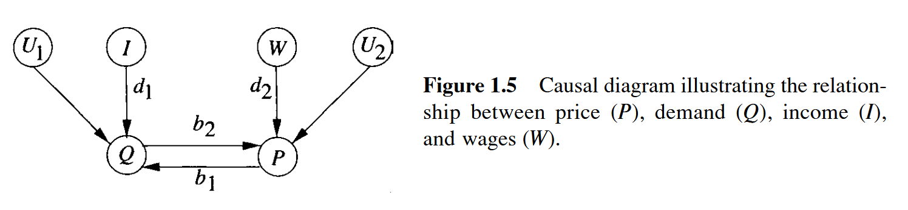

# Chapter 1.4 函数因果模型

## 1.4.1 结构方程

```admonish check
&emsp;&emsp;在一般化形式中，一个 <a id="def1.40">**函数因果模型**</a> 由以下形式的一组方程构成。
\\[ x_i = f_i(pa_i,u_i) &emsp; , &emsp; i=1,...,n  \tag{1.40} \\]

其中，\\( pa_i \\) (即 *父代变量* )表示直接确定 \\( X_i\\) 值的一组变量，而 \\( U_i \\) 表示由遗漏因子所产生的误差(或"扰动")。
```

式(1.40)中函数关系使用的是物理和自然科学中函数的标准解释，这种关系是一种配方、一种策略或者一种 *法则*，具体说明了对于 \\( (PA_i,U_i) \\) 的每一种可能的组合，大自然会赋予 \\( X_i \\) 什么样的值。形如式(1.40)的一组方程(其中每个方程代表一个自治的机制)，称为 *结构模型*。如果每个变量都有一个唯一的方程，其中该变量出现在方程的左边(*统计上称为因变量*)，那么这个模型称为 *结构因果模型(structural causal model,SCM)* 或简称 *因果模型*。数学上，结构方程和纯代数方程之间的区别在于，前者在维持解的代数运算下(例如，将项从方程的一边移到另一边)会改变含义。

&emsp;&emsp;为了说明这点，图1.5描述了关联价格和需求的典型计量经济学模型方程。
\\[ q = b_1 * p + d_1 * i + u_1  \tag{1.42} \\]
\\[ p = b_2 * q + d_2 * w + u_2  \tag{1.43} \\]

其中，Q是家庭对产品A的需求量，P是产品A的单价，I是家庭收入，W是生产产品A的工资率，\\( U_1 和 U_2 \\)表示误差项，即分别影响需求量和价格的未知因素。与该模型对应的图是有环的，与变量 \\( U_1 、U_2、I、W \\) 关联的顶点为根节点，表示相互独立的假定。 ... 类似于所有的反馈系统，这个模型也代表了隐含的动力学：今天的价格是基于昨天的需求决定的，而这些价格将决定下一阶段交易的需求。在背景变量 \\( U_1 和 U_2 \\) 保持不变的情况下，这些方程组的解表示着一种长期的平衡。

...

&emsp;&emsp;相对于变化的动力学，这两个方程被认为是自治的，因为影响一个方程的"外部变化"并不意味着影响另一个方程。例如，如果政府决定价格管控，将价格P定为\\(p_0\\)，那么式(1.43)将修改为使用 \\( p = p_0\\) ，而式(1.42)的关系保持不变。由此可见，"需求弹性" \\(b_1\\) 应解释为受控条件下P的单位变化所带来的的Q的变化率，当然，这与P的(不受控条件下的)观察单位变化所带来的Q的变化率不同，在这种情况下，除了 \\(b_1\\) ，变化率还受式(1.43)参数的影响(见7.2.1节的式(7.14))。受控变化和观察变化之间的区别对于正确解释社会科学和经济学中的结构方程建模至关重要，这将在第5章进行详细讨论。如果我们有理由相信消费者的行为也会受价格控制政策影响而发生变化，那么这种修正后的行为就需要明确地建模，例如，将系数 \\(b_1 和 d_1\\) 作为包含P的附加方程的因变量。[7.2.1节将使用这个模型来分析政策相关问题](./chapter_7_2.md)。

...

## 1.4.2 因果模型中的概率预测

## 1.4.3 函数模型中的干预与因果模型

## 1.4.4 函数模型中的反事实
&emsp;&emsp;现在我们来看函数模型最显著的特点——*反事实分析*。如前所述，某些反事实语句不能再随机因果模型的框架下定义。为了了解其中的难点，让我们考虑一个最简单的因果贝叶斯网络，它由一对独立的(因此是不连通的)二元变量 *X* 和 *Y* 组成。例如，在一个受控的(即随机化的)临床实验中，当我们发现治疗 *X* 对受试者的反映 *Y* (可能代表康复 y = 1 或 死亡 y = 0)的分布没有影响时，对应的鞭尸这个最简单的网络。假定一直受试者John接受了治疗并死亡。我们提出疑问，John的死亡时治疗 *造成* 的，还是于治疗 *无关*。换句话说，我们想要知道如若John当初没有接受治疗，他依然死亡的概率Q。

&emsp;&emsp;为了突出回答这些反事实问题的难度，让我们举一个极端的例子，在治疗组和对照组中，均有50%的患者康复以及50%的患者死亡。进一步假定样本量趋近于无穷，那么得到：
\\[ 对于所有的 x 和 y ， P(y | x) = \frac{1}{2}  \tag{1.46} \\]

熟悉统计检验读者会立即意识到，从现有数据中回答反事实的问题是不可能的。他们会注意到，接收治疗并死亡的John从未在不治疗条件下接受过检验。此外，困难并不是由解决特定个体(John)的问题造成的，虽然我们只有John这一条数据。从总体频率的角度来重新表述这个问题(即对于治疗后死亡的病人，如果他们当初没有接受治疗，那么康复的人的百分比Q会是多少)会遇到同样的困难，因为这些病人也没有在不治疗的条件下接收检验。 

&emsp;&emsp;但是，我们在科学、法律和日常语言中都充满了反事实的表达，这清楚地表明，反事实远非玄奥的问题，它们必须具有明确的可检验的含义，并且必须包含有价值的实质性信息。因此，对于任何认同本书目标的读者来说，反事实分析提供一个机会：将大量的知识与统计数据结合起来，从而完善知识，解释数据。在本书框架内，反事实需要回答一些棘手但可操作性的技术问题：什么是反事实问题的实证性内容？回答这些问题需要什么知识？这些知识如何用数字表示？在这种表示下，需要什么数学机制来推导答案？

&emsp;&emsp;第7章(7.2.2节)给出了反事实的实证解释，该解释要求某些机制具有一定的时间不变性。在我们的实例中，假定每个(康复的)患者对治疗的反映在一段时间是不变的。如果结果变量 *Y* 被设定为反向的条件，即患者并未死亡，那么反事实的要求便是患者对未来治疗反应不变的预设。但即使结果是死亡的情况下，反事实的估计值Q不仅是对死者假想行为的推测，还是对未经治疗的病人在随后治疗中生存量的一种可检验的预判式。依据式(1.46)并排除抽样差异，可以证明治疗后死亡的患者如果当初不接受治疗会康复的百分比Q，精确等于未治疗患者如果接受治疗将死亡的百分比Q'。

&emsp;&emsp;在概述了反事实的实证解释之后，本章下一步要讨论的是表示问题：回答反事实的问题需要什么知识？如何形式化这些知识以便能够快速并可靠地回答反事实问题？人们能够迅速且不谋而合地区分合理与不合理的反事实陈述，这就显示了这种表示的存在的可能。大多数人认为如若克林顿总统当初没有遇见莫妮卡·莱文斯基，那么他在历史上的地位会不同，但很少有人相信，如若他昨天没有吃早餐，那么他在历史上的地位会改变。在认知科学中，这种观点的一致性几乎可以证明人类大脑中存在着一种有效地机器，可以表示和处理反事实。

...

&emsp;&emsp;...在结构模型方法中，反事实是由[函数因果(式1.40)](#def1.40) 推导出来的(事实上是由它定义的。)

&emsp;&emsp;为了厘清反事实和结构方程之间的联系，我们应该首先了解为什么贝叶斯网络描述的信息不足以回答反事实问题，即使这些信息反映在贝叶斯网络的因果解释中。

&emsp;&emsp;再次考虑随机试验(式1.46)的例子，它对应一个无边的贝叶斯网络(图1.6a)，有两个独立的二元变量和一个联合概率：
\\[ 对于所有的x和y，P(y,x)=0.25  \tag{1.47} \\]


现在给出两个函数模型，每个模型均可以生成符合式(1.47)的联合概率分布，然而两个模型得到的值Q(即治疗后死亡的患者如若不接受治疗而会康复的概率)则不同。

- **模型1** (图1.6b)  
  &emsp;&emsp;令
$$
\begin{cases}
x = u_1 \\\\
y = u_2
\end{cases}
$$
  &emsp;&emsp;其中 \\(u_1,u_2\\) 是两个独立的二元变量，\\( P(u_1=1)=P(u_2=1)=\frac{1}{2} \\) (例如,随机抛硬币)。

- **模型2** (图1.6c)  
  &emsp;&emsp;令
$$
\begin{cases}
x = u_1 \\\\
y = x*u_2 + (1-x)(1-u_2)
\end{cases}
\tag{1.48}
$$
  &emsp;&emsp;其中 \\(u_1,u_2\\) 是两个独立的二元变量。

&emsp;&emsp;模型1对应于治疗( *X* )对任何受试者均无效，在模型2中，每个受试者都收到治疗的影响。这两个模型产生相同的分布的原因是模型2描述了两个子群的混合。在第一个子群 (\\( u_2 =1 \\)) 中，每个受试者当且仅当接收治疗后死亡 ( y = 1 );在第二个子群 (\\( u_2 =0 \\)) 中，每个受试者当且仅当接收治疗后康复 ( y = 0 )。图1.7中的表给出了这两个模型对应的分布 \\(P(x,y,u_2)和P(x,y)\\)。 


&emsp;&emsp;因此，两个模型都可以生成符合式(1.47)的联合概率分布，但它们的Q值不同。在模型1中，Q值为0，因为死亡的受试者对应\\(u_2=1\\)，并且由于治疗对y无影响，因此 *X* 从1变为0仍然会得到 y = 1 。然而，在模型2中，Q值为1，因为治疗后死亡的受试者必然对应\\(u_2=1\\)(即那些如果接受治疗就死亡的受试者)，这意味着当且仅当他们不接受治疗就会康复。

&emsp;&emsp;这个例子给我们的第一个经验是，随机因果模型不足以计算反事实的概率，计算还需要了解 \\(P(y|x)\\) 背后的实际过程。第二个经验是，函数因果模型构成的数学对象足以计算(和定义)这样的概率。