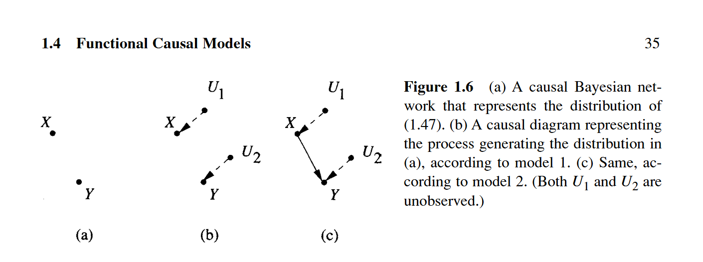
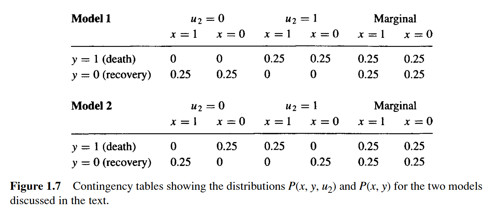

# Chapter 1.4 函数因果模型

## 1.4.1 结构方程

## 1.4.2 因果模型中的概率预测

## 1.4.3 函数模型中的干预与因果模型

## 1.4.4 函数模型中的反事实
...  

&emsp;&emsp;为了厘清反事实和结构方程之间的联系，我们应该首先了解为什么贝叶斯网络描述的信息不足以回答反事实问题，即使这些信息反映在贝叶斯网络的因果解释中。

&emsp;&emsp;再次考虑随机试验(式1.46)的例子，它对应一个无边的贝叶斯网络(图1.6a)，有两个独立的二元变量和一个联合概率：
\\[ 对于所有的x和y，P(y,x)=0.25  \tag{1.47} \\]

</img>

现在给出两个函数模型，每个模型均可以生成符合式(1.47)的联合概率分布，然而两个模型得到的值Q(即治疗后死亡的患者如若不接受治疗而会康复的概率)则不同。

- **模型1** (图1.6b)  
  &emsp;&emsp;令
$$
\begin{cases}
x = u_1 \\\\
y = u_2
\end{cases}
$$
  &emsp;&emsp;其中 \\(u_1,u_2\\) 是两个独立的二元变量，\\( P(u_1=1)=P(u_2=1)=\frac{1}{2} \\) (例如,随机抛硬币)。

- **模型2** (图1.6c)  
  &emsp;&emsp;令
$$
\begin{cases}
x = u_1 \\\\
y = x*u_2 + (1-x)(1-u_2)
\end{cases}
\tag{1.48}
$$
  &emsp;&emsp;其中 \\(u_1,u_2\\) 是两个独立的二元变量。

&emsp;&emsp;模型1对应于治疗( *X* )对任何受试者均无效，在模型2中，每个受试者都收到治疗的影响。这两个模型产生相同的分布的原因是模型2描述了两个子群的混合。在第一个子群 (\\( u_2 =1 \\)) 中，每个受试者当且仅当接收治疗后死亡 ( y = 1 );在第二个子群 (\\( u_2 =0 \\)) 中，每个受试者当且仅当接收治疗后康复 ( y = 0 )。图1.7中的表给出了这两个模型对应的分布 \\(P(x,y,u_2)和P(x,y)\\)。 

</img>

&emsp;&emsp;因此，两个模型都可以生成符合式(1.47)的联合概率分布，但它们的Q值不同。在模型1中，Q值为0，因为死亡的受试者对应\\(u_2=1\\)，并且由于治疗对y无影响，因此 *X* 从1变为0仍然会得到 y = 1 。然而，在模型2中，Q值为1，因为治疗后死亡的受试者必然对应\\(u_2=1\\)(即那些如果接受治疗就死亡的受试者)，这意味着当且仅当他们不接受治疗就会康复。

&emsp;&emsp;这个例子给我们的第一个经验是，随机因果模型不足以计算反事实的概率，计算还需要了解 \\(P(y|x)\\) 背后的实际过程。第二个经验是，函数因果模型构成的数学对象足以计算(和定义)这样的概率。