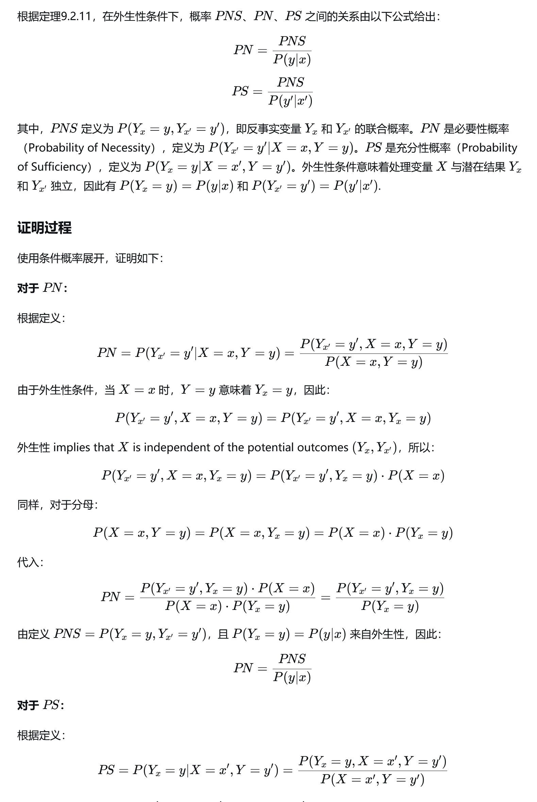
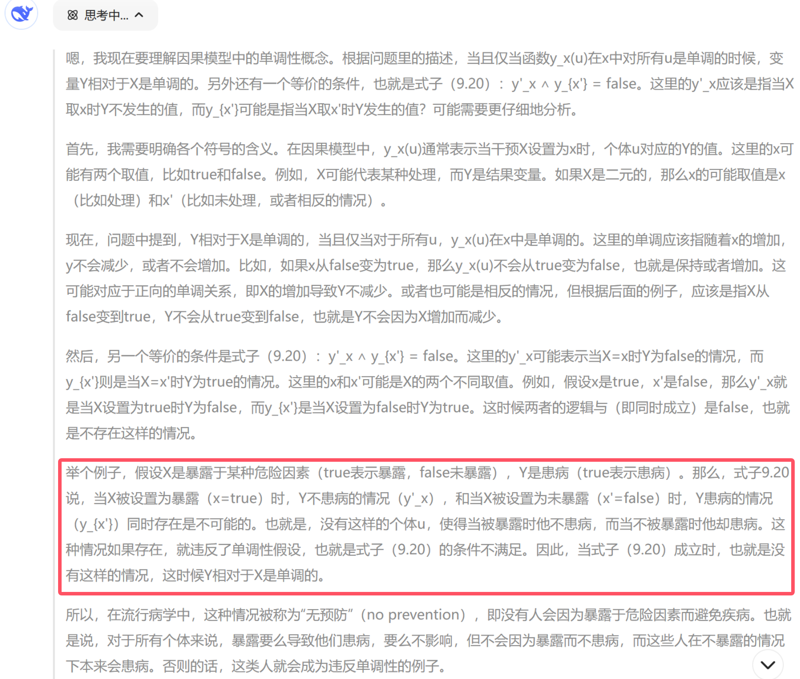

# Chapter 9.2 充分必要原因：识别条件

## 9.2.1 定义、符号和基本关系

```admonish check
### <a id="def9.2.1">定义9.2.1 (必要性概率，PN)</a>
&emsp;&emsp;设 x 和 y 是因果模型M中的两个二值变量， x 和 y 分别代表命题 \\( X = true 和 Y = true\\)，x' 与 y' 表示它们的反值。  

&emsp;&emsp;必要性概率定义为：

$$
\begin{aligned}
    PN &\triangleq P(Y_{x'} = false | X = true, Y = true)  \\\\
     (简记为) &\triangleq P(y'_{x'} | x,y) 
\end{aligned}
\tag{9.1}
$$
```

&emsp;&emsp;换言之，假设x和y实际上确实已经发生，**PN**代表 —— 如若没有事件x，那么事件y不会发生的概率。  

&emsp;&emsp;与7.1节中使用的符号相对比，这里的符号有些细微的变化。小写字母(例如 x 和 y )在7.1节中表示变量的值，但现在表示命题(或事件)。还要注意 \\(y_x\\) 表示 \\(Y_x = true\\) 的简写, \\( y'\_{x} \\) 表示 \\(Y_x = false\\) 的简写。  

```admonish check
### <a id="def9.2.2">定义9.2.2 (充分性概率，PS)</a>  
  
$$
\begin{align}
    PS &\triangleq P(y_x|x',y') \tag{9.2} 
\end{align}
$$

&emsp;&emsp;**PS**度量 x 产生 y 的能力，并且"产生"意味着 x 和 y 从不存在到存在的变换，因此我们对概率 \\(P(y_x)\\)设置了 x 和 y 不存在的条件。于是，**PS**给出了在 x 和 y 不存在的情况下 "如若 x 发生， 那么产生 y" 的概率，这也反映了 x 的某种必要性(由 **PN** 度量)。
```

```admonish check
### <a id="def9.2.3">定义9.2.3 (充分必要性概率，PNS)</a>

$$
\begin{align}
    PNS &\triangleq P(y_x, y'_{x'}) \tag{9.3} 
\end{align}
$$

&emsp;&emsp;**PNS** 代表 y 在两种情况下对 x 作出响应的概率，因此可以度量 x 产生 y 的充分性和必要性。
```
&emsp;&emsp;与上述三个基本概念相联系的其他反事实的量化值引起了应用或概念上的兴趣。我们将提到两个这样的量化值，但不会详细讨论它们的分析过程，因为这些可以从上述概念类似推出。

```admonish check
### <a id="def9.2.4">定义9.2.4 (禁阻概率，PD(Probability of Disablement))</a>

$$
\begin{align}
    PD &\triangleq P(y'_{x'}|y) \tag{9.4} 
\end{align}
$$

&emsp;&emsp;**PD** 度量 y 在没有 x 的情况下被禁阻的概率，因此，希望评估各种预防计划的社会问题决策者对此很感兴趣。
```

```admonish check
### <a id="def9.2.5">定义9.2.5 (启开概率，PE(Probability of Enablement))</a>

$$
\begin{align}
    PE &\triangleq P(y_x|y')  
\end{align}
$$

&emsp;&emsp;**PE** 与 **PS** 类似，只是不以 x' 为条件。例如，当我们希望评估整个健康人群(包括已经暴露的人群)暴露的危险时，它是适用的。
```

&emsp;&emsp;尽管这些量都不足以充分确定其他量，但它们并不是完全独立的，如以下引理所示：

```admonish check
### <a id="cor9.2.6">引理9.2.6 </a>  
因果关系的概率(PNS、PN、PS)满足以下关系：
\\[ PNS = P(x,y)*PN + P(x',y')*PS \tag{9.5} \\] 
**证明：**  
用我们的符号可以将 *一致性条件* ( \\(X=x \Rightarrow Y_x = y\\) ) 翻译成  
\\[ x \Rightarrow (y_x=y), x' \Rightarrow (y_{x'}=y) \\]  
因此我们可以写出  

$$
\begin{aligned}
y_x \wedge y'_{x'} &= (y_x \wedge y'{_x{'}}) \wedge (x \vee {x'})  \\\\
                   &= (y \wedge x \wedge y'{_x{'}}) \vee (y_x \wedge y' \wedge x')
\end{aligned}
$$

利用两边取概率和`x与x'`的互斥性，我们得到  

$$
\begin{aligned}
P(y_x , y'_{x'}) &= P(x,y, y'{_x{'}}) + P(y_x , x', y')  \\\\
                 &= P(y'{_x{'}} | x,y )*P(x,y) + P(y_x | x',y')*P(x',y')  \\\\
                 &= PN * P(x,y) + PS * P(x',y')
\end{aligned}
\tag *{$\square$}
$$
```

&emsp;&emsp;由于到目前为止定义所有因果度量都引用了对 y 的条件化，并且假定 y 受 x 的影响。即使在没有混杂的情况下，我们知道这些量也不能仅从因果图 G(M) 和数据 P(v) 中识别。此外，通常情况下，这些量中没有一个能够决定其他量。然而，在没有混杂的假设下，这些量可以推导出简单的相互关系和有用的界限，我们称之为外生性假设。

## 9.2.2 外生性下的界限与基本关系
```admonish check
### <a id="def_9.2.9">定义 (强)外生性</a>
\\[ \\{ Y_x , Y_{x'} \\} \perp X  \tag{9.7} \\]

&emsp;&emsp;换句话说，*Y* 对条件 x 或 x' 的[**潜在响应**](./chapter_7_1.md#def7.1.4)的方式与 *X* 的实际值无关。
```

&emsp;&emsp;式(9.7)是第5章(式(5.30))和第6章(式(6.10))中使用的公式的一个强化版本，因为它涉及联合变量 \\( \\{ Y_x , Y_{x'} \\}  \\)。Rosenbaum和Rubin(1983)将这种定义命名为"强可忽略性(strong ignorability)"，它与经典的[基于误差的外生性标准(参见7.4.5节)](./chapter_7_4.md#def_exogeneity_error)和后门定义准则3.3.1一致。式(5.30)和[式(7.46)的弱定义](./chapter_7_4.md#def_exogeneity_conterfactual)对于本章中的所有结果都是充分的，**但是式(9.11)、式(9.12)和式(9.19)除外**，因为式(9.11)、式(9.12)和式(9.19)需要满足 *(强)外生性*(式(9.7))。  

&emsp;&emsp;**外生性**的重要性依赖于允许识别\\(\\{P(y_x),P(y_{x'})\\}\\)，即 *X* 对 *Y* 的因果效应。因为使用( \\( x \Rightarrow (y_{x} = y) \\) )可得：
\\[ P(y_x) = P(y_x | x) = P(y | x)  \tag{9.8} \\] 
&emsp;&emsp;对于 \\( P(y_{x'}) \\) 也有类似的归约。


```admonish check
### <a id="thm9.2.10">定理9.2.10 </a>  
在外生性条件下，**PNS** 的界限如下：
\\[ max[0,P(y|x)-P(y|x')] \leqslant PNS \leqslant min[P(y|x),P(y'|x')]   \tag{9.9} \\] 
&emsp;&emsp;这两个边界都是严格的，因为对于每个联合分布 \\(P(x,y)\\) ，都存在一个模型 `y=f(x,u) (其中 u 独立于 x )` ，满足该界限范围内的任意 **PNS** 值。  

&emsp;&emsp;**证明：**  
&emsp;&emsp;对于任意两个事件 A 和 B，我们都有严格的界限
\\[ max[0,P(A)+P(B)-1] \leqslant P(A,B) \leqslant min[P(A),P(B)]   \tag{9.10} \\] 
&emsp;&emsp;式(9.9)根据式(9.3)和式(9.10)，使用 \\(A=y_x , B=y'\_{x'} , P(y_x)=P(y|x) 和 P(y'\_{x'})=P(y'|x') \\) 得到。\\( \tag *{$\square$} \\)

&emsp;&emsp;显然，如果不能确定外生性，那么 **PNS** 被类似于式(9.9)的一个不等式约束，其中使用 \\( P(y_x) 和 P(y'\_{x'}) 分别替代  P(y|x) 和 P(y'|x') \\) 。
\\[ max[0,P(y_x)-P(y\_{x'})] \leqslant PNS \leqslant min[P(y_x),P(y'\_{x'})]  \\]

```

```admonish check
### <a id="thm9.2.11">定理9.2.11 </a>  
在外生性条件下，概率 **PNS**、**PN**、**PS** 之间的相互关联如下：
\\[ PN = \frac{PNS}{P(y|x)}  ; \tag{9.11*} \\] 
\\[ PS = \frac{PNS}{P(y'|x')}   \tag{9.12*} \\] 
&emsp;&emsp;**证明：使用条件概率展开，易证(如下ds都证了)。**  



```

因此，式(9.9)中 **PNS** 的界限为 **PN** 和 **PS** 提供了相应的界限。  
  
&emsp;&emsp;那么，**PN** 的界限为：
\\[ \frac{max[0,P(y|x)-P(y|x')]}{P(y|x)} \leqslant PN \leqslant \frac{min[P(y|x),P(y'|x')]}{P(y|x)}   \tag{9.13} \\] 
即使在外生性存在的**实验性研究**中，该界限仍限制了我们[识别 **PN** 的能力](./chapter_9_1.md#ref_PN)。  
  
&emsp;&emsp;为了完整性起见，我们给出 **PNS** 与禁阻概率和启开概率之间的关系：
\\[ PD = \frac{P(x) * PNS}{P(y)}  &emsp;;&emsp;  PE = \frac{P(x') * PNS}{P(y')}  \tag{9.19*} \\] 

## 9.2.3 单调性和外生性下的可识别性
&emsp;&emsp;在讨论式(9.1)~(9.3)中识别反事实概率的一般问题之前，讨论一个特殊条件是有知道意义的，该条件称为 *单调性(monotonicity)*。通常在实践中这种单调性是被假定的，并且使这些概率是可识别的。由此产生的概率表达式被认为是文献中常见的因果关系度量。  

```admonish check
### <a id="def9.2.13">定义9.2.13 (单调性) </a>  
&emsp;&emsp;在因果模型 M 中，当且仅当函数 \\(y_x(u) 在 x 中对所有 u 是单调时\\)，称变量 *Y* 相对于变量 *X* 是单调的。等价地，*Y* 相对于 *X* 是单调的，当且仅当：
\\[ y'\_x \wedge y_{x'} = false   \tag{9.20} \\] 
```

&emsp;&emsp;单调性表示这种假设：在任何情况下，从 \\( X = false 到 X = true\\) 的变化都不能使 *Y* 从 true 变为 false。在流行病学中，这一假设常常被表达为"无预防"，也就是说，人群中任何个体都不能通过暴露危险而避免疾病。  



> 注意：*单调性* 意味着 式(5.30)的弱外生性 **升级**为了 式(9.7)的强外生性。


```admonish check
### <a id="thm9.2.14">定理9.2.14 (外生性和单调性下的可识别性) </a>  
&emsp;&emsp;如果 *X* 是外生的，*Y* 相对于 *X* 是单调的，那么 **PN** 、 **PS** 和 **PNS** 概率都是可识别的，由式(9.11)和式(9.12)给出，其中：
\\[ PNS = P(y|x) - P(y|x')  \tag{9.21} \\] 
&emsp;&emsp;**证明：**  
  
&emsp;&emsp;记 \\( y_{x'} \vee y'\_{x'} = true \\)，我们有
\\[ y_x = y_x \wedge (y_{x'} \vee y'\_{x'}) = (y_x \wedge y_{x'}) \vee (y_x \wedge y'\_{x'})  \tag{9.24} \\]
且，因为单调性 \\( y'\_x \wedge y_{x'} = false \\)(定义9.2.13)，我们有：  
\\[ y_{x'} = y_{x'} \wedge (y_x \vee y'_x) = (y\_{x'} \wedge y_x) \vee (y\_{x'} \wedge y'_x) \Rightarrow y\_{x'} \wedge y_x   \tag{9.25} \\]
将式(9.25)带回式(9.24)中，我们得到：  
\\[ y_x = y\_{x'} \wedge (y_x \vee y'\_{x'})  \tag{9.26} \\]
上式(9.26)两边取概率，并利用 \\( y\_{x'} 与 y'\_{x'} \\) 的互斥性，我们得到：  
\\[ P(y_x) = P(y\_{x'}) + P(y_x,y'\_{x'}) \\]
\\[\Rightarrow P(y_x,y'\_{x'}) = P(y_x) - P(y\_{x'})   \tag{9.27} \\]
最后，式(9.27)与外生性假设式(9.8)一起推出了式(9.21)。 
\\(\tag *{$\square$}\\)
```

&emsp;&emsp;式(9.21)的等号右边在流行病学中被称为"风险差"(在队列研究中，暴露组与非暴露组的死亡率or风险之差  ： \\(R_1 -R_0 \\))，也被误称为"归因风险(**AR** *Attribution Risk* 或超额危险 *Excess Risk*)"(Hennekens and Buring, 1987)。

&emsp;&emsp;从式(9.11)中我们可以看出，必要性概率是可识别的，并由超额风险率( *Excess Risk Ratio* , **ERR** 或归因危险度百分比 **AR%** )给出：
\\[ PN = \frac{PNS}{P(y|x)} = \frac{P(y|x) - P(y|x')}{P(y|x)} = \frac{R_1 - R_0}{R_1} \tag{9.22} \\] 
\\[  RR (相对危险度：队列研究中，暴露组与非暴露组的死亡率(or风险)之比)  ： \frac{R_1}{R_0} \\]
\\[  ERR (超额风险率或归因危险度百分比AR\\%)  ： \frac{R_1 -R_0}{R_1} = 1 - \frac{1}{RR} \\]


&emsp;&emsp;这个概率通常被误称为"归因分数(Schlesselman, 1982)"、"归因率百分比(Hennekens and Buring, 1987)"或"归因比例(Cole, 1997)"。我们认为这些标签是误称的原因在于ERR仅涉及纯粹统计关系，因此它本身不能用来衡量归因，除非与某些因果假设相结合。外生性和单调性是赋予ERR归因解释的因果假设，而这些假设在归因文献中很少被明确提出。  
&emsp;&emsp;从字面上看，式(9.22)中的比率与归因无关，因为它由统计术语组成，而不是由因果关系或反事实关系组成。然而，外生性和单调性的假设使我们能够将 **PN** 定义中的归因概念(式(9.1))转化为纯统计关联的比率。这表明，许多作者提出或推导式(9.22)作为"归因于暴露因素的暴露疾病比例"的度量都默认了外生性和单调性。  
  
&emsp;&emsp; **PS** (式(9.12))的表达式同样能够说明问题：
\\[ PS = \frac{PNS}{P(y'|x')} = \frac{P(y|x) - P(y|x')}{1-P(y|x')} = \frac{R_1 - R_0}{1 - R_0} = 1 -\frac{1 - R_1}{1 - R_0} = 1 - \frac{P(y'|x)}{P(y'|x')}  \tag{9.23} \\] 

&emsp;&emsp;因为它与流行病学家所称的"相对差(Shep, 1958)"吻合，后者用于测量人群对暴露 x 的 *易感性* 。易感性被定义为具有"足以使人在暴露后感染疾病的潜在因素"的人群比例(Khoury et al., 1989)。 **PS** 提供了对易感性的形式化反事实解释，这种解释使定义更加清晰，使易感性易于系统分析。  

&emsp;&emsp;Khoury等人(1989)通过三个假设：无混杂、单调性和独立性(即假设暴露易感性与背景易感性无关)认识到易感性一般是不可识别的，也不能推导出式(9.23)。最后一个假设常常被批评为站不住脚，[定理9.2.14](#thm9.2.14)向我们证明了独立性实际上是不必要的。仅需要外生性和单调性，式(9.23)的计算就具备有效性。  

&emsp;&emsp;式(9.23)也与Cheng(1997)所称的"因果力"一致，即在抑制"y 的所有其他原因"后，x 对 y 的效应。**PS** 的范式是定义表明了对该量的另一种解释。它度量了在实际上不存在的 x 和 y 的情况下假设 x 产生 y 的概率。对 y' 的条件作用相当于选择了(或假设)那些"y 的所有其他原因"都被抑制的世界。  

&emsp;&emsp;然而，需要注意的是，三个因果关系概念(式(9.11)~(9.12))之间的简单关系仅在外生性假设下成立。在一般情况下，是式(9.5)这种较弱的关系。此外，所有这些因果关系的概念都是根据全局关系 \\( Y_x(u) 和 Y_{x'}(u) \\) 定义的，这对于完整描述因果关系的许多细节来说过于粗糙。从 x 到 y 的因果模型的详细结构往往需要提供更精确的概念，如"实际原因"(见第10章)。

## 9.2.4 单调性和非外生性下的可识别性
&emsp;&emsp;定理9.2.10~定理9.2.14中建立的关系时基于外生性假设的。在本节中，我们放宽了这一假设，并考虑 *X* 对 *Y* 的影响有混杂的情况，即 \\( P(y_x) \neq P(y|x) \\)。在这种情况下，\\( P(y_x)\\) 仍然可以通过辅助手段(例如，通过校正某些协变量或通过实验研究)来估计，但问题是，这些附加信息是否能够使因果关系的概率变得可识别。答案是肯定的：

```admonish check
### <a id="thm9.2.15">定理9.2.15 </a>  
&emsp;&emsp;如果 *Y* 相对于 *X* 是单调的，那么当因果效应 \\( P(y_x) 和 P(y_{x'}) \\)可识别时， **PN** 、 **PS** 和 **PNS** 概率都是可识别的：
\\[ PNS = P(y_x,y'_{x'}) = P(y_x) - P(y\_{x'})  \tag{9.28 (from 9.27 )$\square$} \\] 

\\[ PN = P(y'\_{x'}|x,y) = \frac{P(y) - P(y\_{x'})}{P(x,y)}  \tag{9.29} \\]

\\[ PS = P(y_x|x',y') = \frac{P(y_x) - P(y)}{P(x',y')}  \tag{9.30} \\]
&emsp;&emsp;**证明：**  
&emsp;&emsp;为了证明式(9.30)，且因为 \\( x' \wedge y' = x' \wedge y'_{x'} \\) (一致性)，我们写作
\\[ P(y_x|x',y') = \frac{P(y_x,x',y')}{P(x',y')} = \frac{P(y_x,x',y'\_{x'})}{P(x',y')}  \tag{9.34} \\]

为了计算式(9.34)的分子，我们将式(9.26)与 x' 结合得到：
\\[ x' \wedge y_x = (x' \wedge y_{x'}) \vee (y_x \wedge y'_{x'} \wedge x')  \\]

&emsp;&emsp;然后，我们取两边的概率，得出(因为 \\( y_{x'} 与 y'_{x'} \\) 是互斥的)：
$$
\\begin{aligned}
P(y_x,y'\_{x'},x') &= P(x',y_x) - P(x', y\_{x'})  \\\\
                   &= P(x',y_x) - P(x',y)  \\\\
                   &= \underbrace{P(y_x) - P(x,y_x)} - P(x',y)  \\\\
                   &= P(y_x) \underbrace{ - P(x,y) - P(x',y)}  \\\\
                   &= P(y_x) - P(y)  \\\\
\\end{aligned}
$$

&emsp;&emsp;代回式(9.34)中，最终得到：  
\\[P(y_x|x',y') = \frac{P(y_x) - P(y)}{P(x',y')}\\]
\\(\tag *{$\square$}\\)
&emsp;&emsp;式(9.29)同理可证。
\\(\tag *{$\square$}\\)
```

&emsp;&emsp;为了理解式(9.29)和式(9.22)之间的差异之处，我们可以展开 \\(P(y)\\) 并得到：
$$
\begin{align}
    PN &= \frac{P(y|x) * P(x) + P(y|x') * P(x') - P(y_{x'})}{P(y|x) * P(x)}  \\\\
       &= \frac{P(y|x) * P(x) + [P(y|x') * P(x') \underbrace{ - P(y|x')] + P(y|x')} - P(y_{x'})}{P(y|x) * P(x)}  \\\\
       &= \underbrace{\frac{P(y|x) - P(y|x')}{P(y|x)}} + \frac{P(y|x') - P(y_{x'})}{P(x,y)} 
\end{align}
\tag{9.31}
$$

&emsp;&emsp;式(9.31)等号右边的第一项是我们熟悉的超额风险率式(9.22)，表示在外生性下的 **PN** 值。第二项表示解释混杂所需的校正，也就是 \\( P(y_{x'}) \neq P(y|x')) \\)。  

&emsp;&emsp;因此，式(9.28)\~(9.30)提供了更精确的因果关系度量，可用于因果关系 \\( P(y_x) \\) 通过辅助手段识别的情况(参见9.3.4节)。也可以证明，式(9.28)\~(9.30)中的表达式为 **PNS**、**PN** 和 **PS** 提供了一般非单调情况下的下界[(Tian and Pearl, 2000, 11.9.2节)](#TianPearl2000)。

### 值得注意的是，由于 **PS** 和 **PN** 必须是非负的，因此式(9.29)和(9.30)为单调性假设提供了一个简单必要的检验：
\\[ P(y_x) \geq P(y) \geq P(y_{x'})  \tag{9.32} \\]
&emsp;&emsp;它收紧了标准不等式(从 \\( x' \wedge y \Rightarrow y_{x'} \\) 和 \\( x \wedge y' \Rightarrow y'\_x \\))
\\[ P(y_{x'}) \geq P(x',y) &emsp; , &emsp; P(y'\_x) \geq P(x,y')  \tag{9.33} \\]

&emsp;&emsp;[J.Tian(Tian and Pearl, 2000)](#TianPearl2000)已经证明了事实上这些不等式是严格的：满足这些不等式的试验和非实验数据的每种组合都可以从某些因果模型中产生，其中 *Y* 相对于 *X* 是单调的。"无预防"的一般性假设并不能完全免除实验性的工作，这应该让许多流行病学家感到宽慰。  

&emsp;&emsp;**换言之，<a id = "ref9.2.4">[如果"无预防"假设在理论上是不可辩驳的，那么式(9.32)就可以用于测试实验数据和非实验数据的一致性](./chapter_9_3.md#ref9.3.4)</a>，即临床试验中的受试者是否代表了以联合分布 \\( P(x,y) \\) 刻画的目标人群。**
***

<span id="TianPearl2000">**Tian and Pearl 2000,** [Probabilities of causation: Bounds and identification.(PDF)](./img/9.2/translate%20Probabilitis%20of%20causation%20Bounds%20and%20identification.pdf) *Annals of Mathematics and Artificial Intelligence*, 28:287-313, 2000.</span>