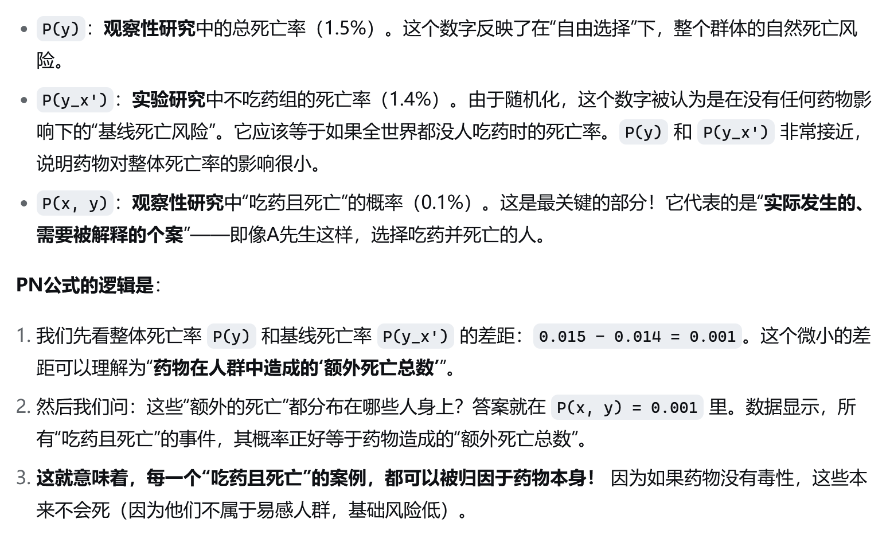

# Chapter 9.3 实例与应用

## 9.3.1 实例1：公平硬币下注


## 9.3.2 实例2：刑罚执行


## 9.3.3 实例3：辐射对白血病的影响


## 9.3.4 实例4：来自实验数据和非实验数据的法律责任
&emsp;&emsp;在一起针对制药公司的诉讼中，指控药物x可能导致A先生死亡，A先生服用该药是为了缓解与疾病D相关的症状S。

&emsp;&emsp;制药公司声称，关于症状S的病人的实验数据确凿地表明，药物x可能只会导致死亡率轻微上升。然而，原告辩对，实验研究与本案关系不大，因为它代表了药物对所有患者的影响，而不是像A先生这样在使用药物x时实际死亡的患者的影响。此外，原告认为，A先生的独特之处在于他是自愿服用药物的，这与实验研究中的受试者不同(受试者是随机分配的)，他们服用药物时为了遵守实验协议。为了支持这一论点，原告提供了非实验的观察数据，表明如果不是药物x，大多数选择药物x的病人都会活着。制药公司反驳称：(1)关于病人是否会死亡的反事实推测纯粹是空洞的、不切实际的，应该避免；(2)非实验数据应该首先被排除，因为这些数据可能会被外部因素严重混杂。法院现在必须根据实验性和非实验性的研究来决定药物x是A先生的死亡原因的概率有多大。  

&emsp;&emsp;与两项研究相关的(假设)数据如表9.2所示。

&emsp;&emsp;对实验数据进行估算:
\\[ P(y_x) = 16/1000 = 0.016  \tag{9.49} \\]
\\[ P(y_{x'}) = 14/1000 = 0.014  \tag{9.50} \\]

&emsp;&emsp;对非实验数据进行估算:
\\[ P(y) = 30/2000 = 0.015  \tag{9.51} \\]
\\[ P(y,x) = 2/2000 = 0.001  \tag{9.52} \\]

<p align="center" >表 9.2</p>

|   实验类型     | 实验性 |  | 非实验性|    |
|----------------|---------------|---------------|---------------|--|
|               |x |x'| x |x'|
| **死亡 (y)** | 16|14            |2     | 28           |
| **存活 (y')** | 984  | 986  |    998  | 972|

&emsp;&emsp;将这些估计值代入[式(9.29)](./chapter_9_2.md#thm9.2.15)中，得到了PN的一个下界(见式11.42)  
\\[PN \geq \frac{P(y)-P(y_{x'})}{P(x,y)} = \frac{0.015-0.014}{0.001}=1.00 \tag{9.53} \\]

因此，原告是正确的。除抽样误差外，结合这些实验和非实验数据为我们提供了100%的保证，该药物x实际上是A先生死亡的原因。

请注意，直接使用实验研究的超额风险率计算PN将产生更低(和不正确)的结果：  
\\[ \frac{P(y_x) - p(y_{x'})}{P(y_x)} = \frac{0.016-0.014}{0.016} = 0.125 \tag{9.54} \\]
```admonish caution title="不满足(强)外生性"
使用孪生网络法画出因果图，其中 *X* 与 *Y** 之间存在一条未被阻断的后门通路，因此不满足外生性，因而不能直接使用实验研究的超额风险率计算PN。


```

&emsp;&emsp;显然，实验研究显示平均来看药物的使用是轻微提高了人群死亡率，但仅看实验研究没有揭示自然情况下“如果有选择的话，晚期患者会避免使用药物x”。

&emsp;&emsp;在非实验环境中，患者基于自身情况选择是否服用x。终末期患者可能因为病情严重而避免服用x（例如，担心副作用或其他原因），因此，服用x的患者大多是健康状况较好的个体。这解释了为什么非实验数据中服用x的死亡率很低。事实上，如果有任何晚期患者会选择服用x(假设)，那么对照组中也会包括一些这样的病人(由于随机化)，因此对照组中的死亡比例 \\(P(y_{x'})\\) 会高于非实验观察中未服用x的死亡的人数比例(因为对照组包含了终末期患者，而在非实验观察的总体中不服用x的患者可能不包括那些本会选择x的终末期患者)。然而，等式\\( P(y_{x'}) = P(y , x') \\) 告诉我们是否定的 ，对照组中没有这类病人，这意味着在整个人群中不存在这样的病人，因此自由选择服用药物x的病人没有一个是晚期患者，所有的患者都易受x的影响，服用药物x增加了死亡概率。 

```admonish caution title="关键概念与逻辑链"
此例中，充分说明了随机化中对照组的重要作用：——实验研究中不吃药组的死亡率（1.4%），由于随机化，这个数字被认为是在没有任何药物影响下的“**基线死亡风险**”。逻辑上，若未观察到**对照组**与之对应的自然条件下人群子群有差异，则在随机化确保了治疗组和对照组在基线特征(同一人群)上均衡的条件下，可以推断出药物x的作用是死亡率升高的唯一解释:


>下面这段是用因果图来理解👇


```

&emsp;&emsp;表9.2中的数字显然是为了表示一种极端情况而设计的，因此有助于对式(9.29)的有效性进行定性解释。<a id="exm9.3.4">[然而，值得注意的是，此例展示了实验研究和非实验研究的结合可能会揭开仅靠实验研究无法揭示的问题](./chapter_9.md#exm9.3.4)</a>，此外，这种结合可能会为实验步骤的充分性提供必要的检验。例如，如果表9.2中的数字稍有不同，则对于式(9.53)中的 **PN** ，很容易产生大于1或其他违反式(9.33)的基本不等式的情况。这种违反很可能表明，由于采样步充分，实验组和非实验组的数据不相容。  

&emsp;&emsp;最后需要解释的一点可能是，让读者们都知道，为什么在不同的实验条件下从两个不同的组中提取数据集会相互约束。解释是，如果两个亚群体是从整个总群中合理取样的，那么这两个亚群体中的某些数值预计将保持不变，不受这些差异的影响。这些不变量就是因果效应概率 \\( P(y_{x'}) 和 P(y_x) \\)。尽管这些反事实概率无法在观察组中进行测量，但它们必须(根据定义式)与在实验组中所测量得到的概率相同。这些量的不变性是受控实验的基本公理，没有这个公理，就不可能从实验研究中推断出群体的一般行为。<a id = "ref9.3.4">[这些量的不变性意味着不等式(9.33)，并且如果单调性成立，那么必然会出现式(9.32)](./chapter_9_2.md#ref9.2.4)</a>。

## 9.3.5 实例5：结果总结


***

\\[ min \left\\{1, \frac{P(y'\_{x'}) - P(x',y')}{P(x,y)}  \right\\} \geq PN \geq max \left\\{0, \frac{P(y)-P(y_{x'})}{P(x,y)} \right\\}   \\\\    \tag{11.42}
 min \left\\{1, \frac{P(y_x) - P(x,y)}{P(x',y')}  \right\\} \geq PS \geq max \left\\{0, \frac{P(y_x)-P(y)}{P(x',y')} \right\\}
 \\]