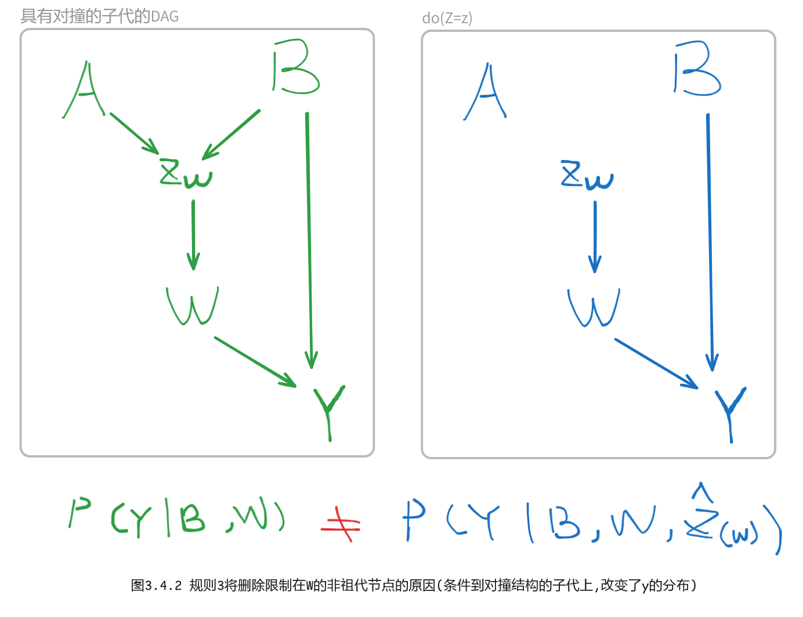
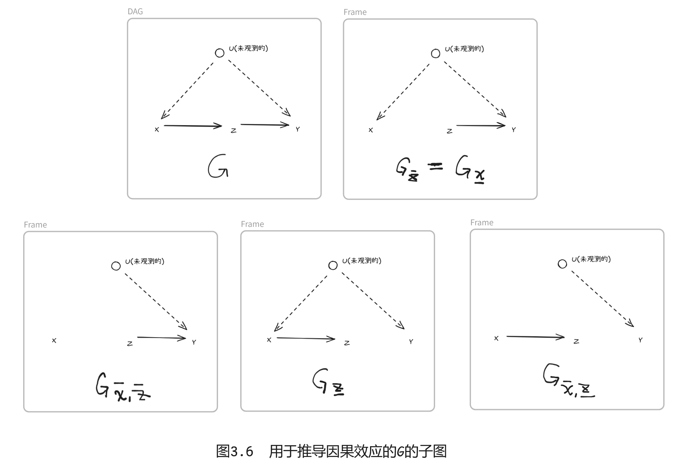

# Chapter 3.4 干预的计算
&emsp;&emsp;本节建立了一套推断规则，通过这些规则，可以将包含干预和观察的概率性命题转换成其他此类命题，从而提供一种推导(或验证)干预断言的句法方法。每个推断规则都将 *do*(·) 操作解释为一种修改底层模型中某些选择函数的干预。从这种解释中产生的推断规则称为 *do算子* (*do* calculus, *do* 演算)公理。  
&emsp;&emsp;假定我们有一个因果图G的结构，其中一些节点是可观测的，而另一些节点是不可观测的。我们的目标是要得到形如 \\(P(y|\hat{x})\\) 的因果效应表达式的语句推导，其中 *X* 和 *Y* 代表观测变量的任意子集。对于“推导”，我们的意思是将表达式 \\(P(y|\hat{x})\\) 逐步约减为包含观察值的标准概率等式。只要这种约减可行， *X* 对 *Y* 的因果效应是[可识别的(参见定义3.2.3](./chapter_3_2.md#def3.2.3))。
## 3.4.1 符号准备
&emsp;&emsp;令 *X*, *Y*, *Z* 为有向无环的因果图 *G* 中任意不相交的节点集。从 *G* 中删除所有指向节点 *X* 的边后得到的图表示为 \\(G_\bar{X}\\) 。同样的，从G中删除所有从节点X触发的边后得到的图表示为 \\(G_\underset{\bar{}}{X}\\) 。删除指向 *X* 和从 *Z* 出发的边后得到的图表示为 \\(G_{\bar{X}, \underset{\bar{}}{Z}}\\) (参见[图3.6](#fig3.6)以获得说明)。最后，表达式 \\(P(y|\hat{x}, z)\\) 表示当 *X* 固定为常数 *x* 时，并且(在此条件下) *Z=z* 被观察到时，*Y=y* 的概率。


## 3.4.2 推断规则
下面的定理陈述了本节提出的演算的三个基本推断规则。[Pearl(1995a)](#Pearl1995a)给出了证明。
### <a id="thm3.4.1">定理3.4.1( *do* 算子准则)</a>
令G表示如[式(3.2)](./chapter_3_2.md#form3.2)定义的与因果模型对应的有向无环图，令P(·)表示该模型蕴含的概率分布。对于任何不相交的变量子集 *X*, *Y*, *Z*, *W*, 我们有以下三条规则：

```admonish check
#### 规则1 (插入 / 删除 观测变量)
&emsp;&emsp;当\\( (Y \perp Z | X , W)_{G\_\bar{X}}\\) 时,  \\(P(y | \hat{x}, z, w) = P(y | \hat{x}, w) \tag{3.3.1}\\)

#### 规则2 (行为 / 观察 交换)
&emsp;&emsp;当\\( (Y \perp Z | X , W)_{G\_{\bar{X} , \underset{\bar{}}{Z} } }\\) 时,  \\(P(y | \hat{x}, \hat{z}, w) = P(y | \hat{x}, z, w) \tag{3.3.2}\\)


#### 规则3 (插入 / 删除 行为)
&emsp;&emsp;当\\( (Y \perp Z | X , W)_{G\_{\bar{X} , \overline{Z(W)} } }\\) 时,  \\(P(y | \hat{x}, \hat{z}, w) = P(y | \hat{x}, w) \tag{3.3.3}\\)  

&emsp;&emsp;其中 *Z(W)* 是在\\(G_\bar{X}\\)中属于 *Z* 但不属于 *W祖代* 的节点集合。  

```

&emsp;&emsp;每一条推断规则都遵循"带帽"操作符 \\(\hat{x}\\) 的基本解释，即将连接 *X* 与干预前父代变量的因果机制替换为干预后引入的新机制X=x，得到由子图 \\(G_\bar{X}\\) 刻画的 *子模型(submodel)* (Spirtes等人(1993)将其命名为"操作后的图")。  
- `规则1` 重申了 *d-分离* 是干预 *do(X = x)* (因此得到图\\(G_\bar{X}\\))所产生的分布中条件独立性的有效检验。这一规则遵循这样的事实：从系统中删除方程不会在剩余的干扰项之间引入任何依赖关系。  
- `规则2` 为外部干预 *do(Z=z)* 提供了一个条件，使其对 *Y* 产生的效应与被动观察 *Z=z* 的结果一致。该条件相当于 \\( \\{ X \bigcup U \\} \\) 阻断 ( \\(G_\bar{X}\\) 中)所有从 *Z* 到 *Y* 的后门路径，因为 \\(G_{\bar{X} , \underset{\bar{}}{Z}}\\) 仅保留了所有这样的路径。  
- `规则3` 为引入(或删除)外部干预 *do(Z=z)* 而不影响 *Y=y* 的概率提供了条件。同样，该规则的有效性起源于通过删除与 *Z* 中变量相对应的所有方程 (因此得到图 \\(G_{\bar{X} , \overline{Z(W)}}\\))来模拟干预 *do(Z=z)* 。[Pearl(1995a)](#Pearl1995a)提供了规则1~3的证明以及将删除限制在 *W* 的非祖代节点的原因:
```admonish check  
依据为 [*d-分离* 准则的要求: 在有对撞结构时，不可条件到子代。](./chapter_1_2.md#def1.2.3)
</img>
```

## 3.4.3 因果效应的符号推导:一个实例

&emsp;&emsp;现在，我们来演示如何使用上节`规则1 ~ 3`推导下图 *G* 所示结构中的所有因果效应的估计。图3.6展示了后续推导所需要的子图。
</img>

```admonish tip
优先尝试的顺序：规则2 -> 规则1 -> 规则3  
最直接的第一步是可否直接用观察替换掉do算子  
> *do-算子* 的规则都是 *d-分离* 准则的应用 ：

- 替换观察和行为，看Z出边后的图与Y是否独立；
- 增删观测变量或行为，符合 *d分离* 要求。

 
```

### 任务 1：计算 \\(P(z|\hat{x})\\)
&emsp;&emsp;由于图 *G* 满足 `规则2` 的应用条件，因此这个任务可一步完成。在 \\(G_\bar{X} 中 X \perp Z\\) (因为路径 `X ← U → Y ← Z` 被汇聚到 *Y* 的箭头阻断了)，我们有：  
\\[P(z| \hat{x}) = P(z |x) \tag{3.34} \\] 

### 任务 2：计算 \\(P(y|\hat{z})\\)
&emsp;&emsp;由于

### 任务 3：计算 \\(P(y|\hat{x})\\)
&emsp;&emsp;可写为：

### 任务 4：计算 \\(P(y, z | \hat{x})\\)
&emsp;&emsp;我们有：

### 任务 5：计算 \\(P(x, y | \hat{z})\\)
&emsp;&emsp;我们有：


## 3.4.4 基于替代试验的因果推断
&emsp;&emsp;假设我们希望在 \\(P(y|\hat{x})\\) 不可识别时学习 *X* 对 *Y* 的因果效应，而由于成本或伦理的现实原因，我们不能通过随机化实验(randomized experiment)控制 *X* 。这产生了一个问题： \\(P(y|\hat{x})\\) 是否可以通过随机化一个比 *X* 更容易控制的代理变量 *Z* 来识别。例如，如果我们想要评估胆固醇水平( *X* )对心脏病( *Y* )的效应，，一个合理的实验应该是控制受试者的饮食( *Z* )，而不是直接控制受试者血液中的胆固醇水平。  
```admonish check
&emsp;&emsp;形式上，这个问题相当于将 \\(P(y|\hat{x})\\) 替换为只有 *Z* 的成员含带帽符号的表达式。利用定理3.4.1，可以证明以下条件足以决定代理变量 *Z* ：  
&emsp;&emsp;(Ⅰ) *X* 截断了所有从 *Z* 到 *Y* 的[有向路径](./chapter_1_2.md#deforderpath)。  
&emsp;&emsp;(Ⅱ) \\(P(y|\hat{x})\\) 在 \\(G_\bar{Z}\\)中是可识别的。  
```


&emsp;&emsp;事实上，如果条件 (Ⅰ) 成立，那么我们得到 \\(P(y|\hat{x}) = P(y|\hat{x}, \hat{z}) \\)，
因为 \\( (Y \perp Z | X , W)_{G\_{\bar{X}, \bar{Z}}} \\) 。
与此同时，\\(P(y|\hat{x},\hat{z}) \\) 代表 \\(G\_\bar{Z}\\)对应的模型中 *X* 对 *Y* 的因果效应，依据条件 (Ⅱ) ，这是可识别的。结合到胆固醇的实例中，这些条件要求饮食对心脏状况没有直接效应，并且胆固醇水平和心脏病之间无混杂，除非我们能通过额外的测量消除这种混杂。  
&emsp;&emsp;图3.9e和图3.9h(参见3.5.2节)展示了这两种条件都成立的模型。以图3.9e为例，我们得到了如下估计值：


***

<span id="Pearl1995a">**Pearl 1995a,** Causal diagrams for empirical research.*Biometrika*, 82(4):669-710,December 1995.</span>

<span id="Pearl1995b">**Pearl 1995b,** Causal inference from inderect experiments.*Artificial Interlligence in Medicine*, 7(6):561-582, 1995.</span>