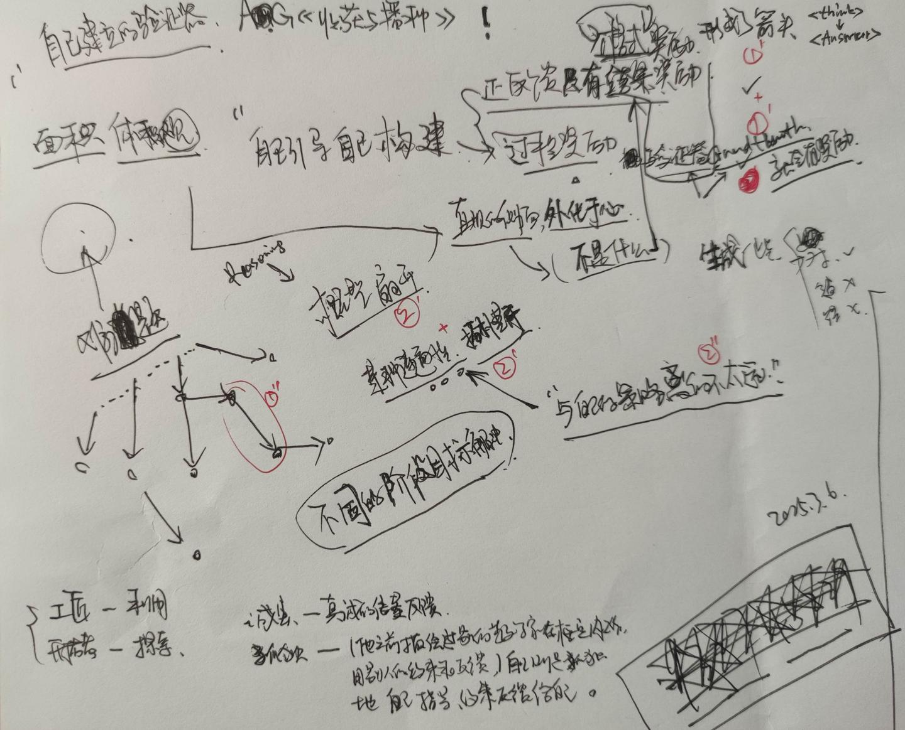

# 穿越时空的“内心戏”

> 2025-03-06

## <<收获与播种>>

- 起手先感谢一手DeepSeekR1，能够提供法文翻译，让我读到这么好的作品。

### <<收获与播种>> 读了100多页，发现作者在试图勾勒自己内心的“天真”。  
#### ——A·G回忆在 17岁时候自己的探索“面积、体积观”的内观，和算术几何建立遵循一样的内在的天真。  
#### 这启发了我“自己引导自己构建”与RL的完整对应：  
- 正反馈只有
- 1. 格式奖励：
  - 1.1 \<think\> -> \<Answer\> 形成了箭头
- 2. 结果奖励:
  - 2.1 “直观的侧面、外化与心”（不是什么），指向结果奖励
  - 2.2 验证器，只要有GroundTruth，就会有奖励
  - 2.3 确认了箭头

> 概型扇开的有向图 + 某种连通性(拓普斯)的对应 <-> “RL训练时候与自己的策略函数里的不太远” 两者是等价的

  
- 工匠 对应 利用 exploit
- 探索者 对应 探索 explore
- 诚实 对应 真诚的接收feedback
- 孤独 对应 （他之前描绘的别的数学家在框定内工作，用别人的约束和反馈），自己则是孤独地自己指导、约束和反馈给自己。