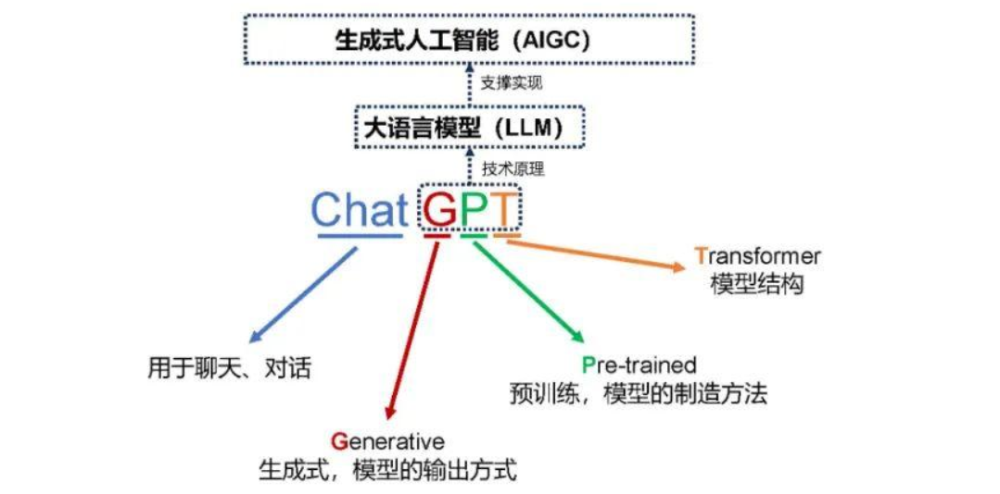

# 历史背景

## 2018年至今：LLM的演进
自**Transformer**架构[^1]被引入以来，NLP领域的技术发展迅速进入了快车道。特别是以**GPT**为代表的自回归生成模型[^2]，通过大规模预训练，显著提升了机器理解和生成自然语言的能力。然而，模型规模的扩大也带来了挑战：

- 计算资源需求激增
- 数据隐私伦理问题
- 开源与闭源生态的分化

## LLM 生态现状
当前，LLM领域的研究仍处于起步阶段，成本高、算力垄断等带来的多样性不足阻碍了技术的发展，高校和小组科研团队因资源限制难以参与LLM研究，普通用户选择闭源工具或付费服务空间有限。

## 让人在一起[^3]  

作为近年来该领域的一个重要成果，DeepSeek R1代表着一种解决方案，旨在应对当前面临的挑战，通过开源的方式突破瓶颈，并推动技术创新。

> [央视《面对面》专访王坚院士](https://news.cctv.com/2025/03/03/ARTIaVUNp9nXZLGYUs7zNLmT250303.shtml)  

[^1]: : **Transformer**架构 : [https://arthurchiao.art/blog/visual-intro-to-transformers-zh/](https://arthurchiao.art/blog/visual-intro-to-transformers-zh/)

[^2]: : **GPT**为代表的自回归生成模型 : [https://bbycroft.net/gpt](https://bbycroft.net/llm)

[^3]: : 央视《面对面》专访王坚院士 : [https://news.cctv.com/2025/03/03/ARTIaVUNp9nXZLGYUs7zNLmT250303.shtml](https://news.cctv.com/2025/03/03/ARTIaVUNp9nXZLGYUs7zNLmT250303.shtml)