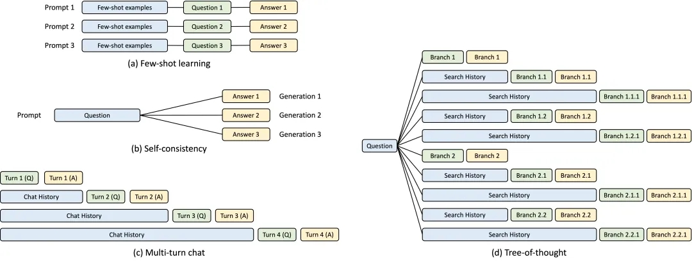

# 3.1 模型架构

DeepSeekR1采用的是基于Transformer的Decoder-only架构，这种设计允许模型通过GPU、TPU等专用硬件加速计算，实现高效的并行计算。

随着OpenAI对Scaling Law方向的研究，长文本序列的训练成为可能，发展出了
- **RoPE（旋转位置编码）:** 将相对位置信息依赖集成到Self-Attention中，具有更好的外推性[^1]，提升长文本处理能力
- **KV Cache(Key-Value pair 缓存):** 利用缓存技术减少重复计算，提升模型计算效率
- **MOE（多专家模型架构）:** 通过利用稀疏化，在保持模型高参数量的同时提升模型计算性能和模型的鲁棒性

这些技术优化不仅提升了模型处理长距离依赖关系的能力，同时也增强了其在复杂任务上的表现力。

***

  

    
     
    <a href="./img/KV-Cache.jpg">KV-Cache 优化</a>
  

  

    
     
    <a href="./img/RoPE.png">RoPE</a>
  

  

    
     
    <a href="./img/all2all4moe.png">MoE 架构</a>
  

[^1]: : **外推性**是指大模型在训练时和预测时的输入长度不一致，导致模型的泛化能力下降的问题。例如，如果一个模型在训练时只使用了512个token的文本，那么在预测时如果输入超过512个token，模型可能无法正确处理。这就限制了大模型在处理长文本或多轮对话等任务时的效果。