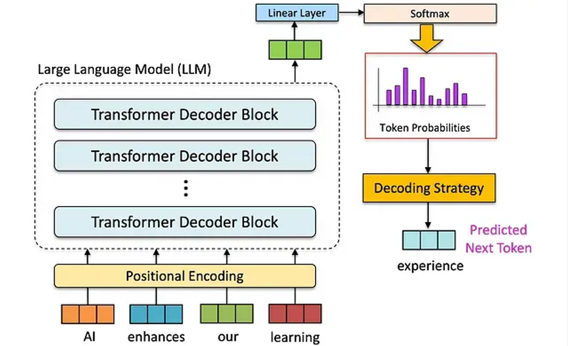
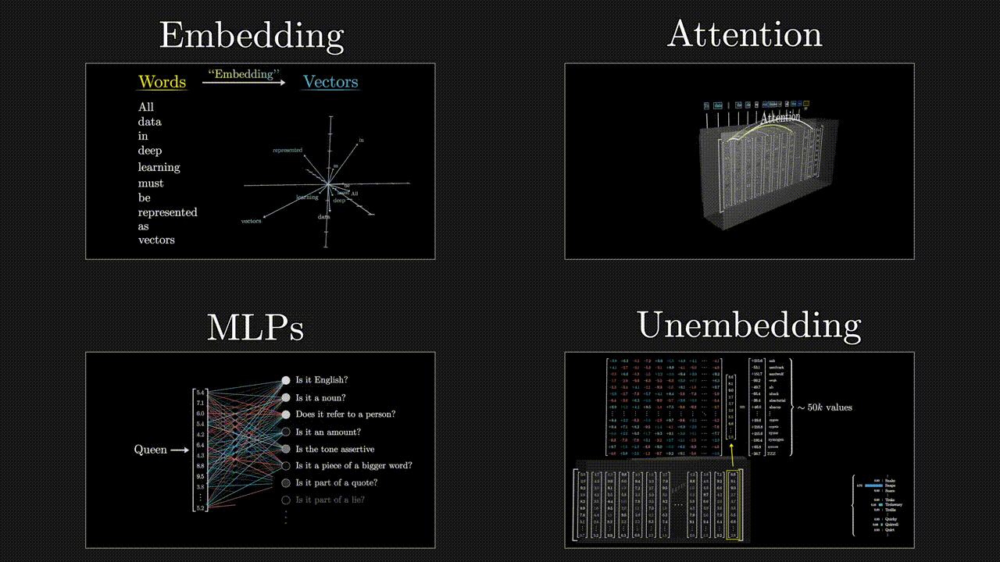
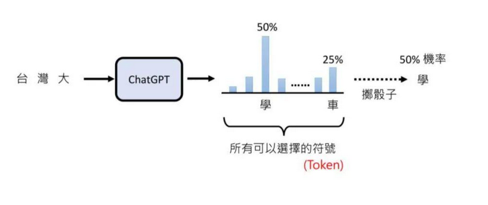
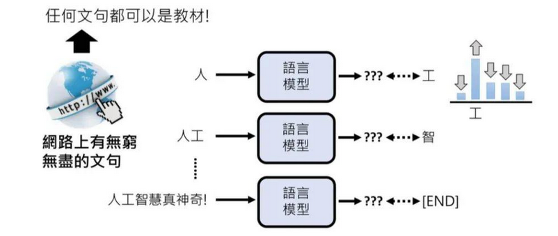

# 3.2 预训练（Pretrain）

预训练阶段是构建一个强大LLM的基础。
- 1. **数据收集:** 收集大量的文本数据，包括语料库、新闻、论文、维基百科等。
- 2. **数据预处理:** 对数据进行清洗、分词、词形还原等预处理操作，以提高模型的泛化能力。
- 3. **分词技术:** 通过BPE(Byte Pair Encoding)或BBPE(Byte-level BPE)统计词频、构建词表、词向量等方式，构建词表映射。**这个步骤对于后续的自监督学习至关重要，因为它直接决定了模型如何理解输入数据。**
- 4. **训练目标:** 利用自回归生成的方式预测下一个词的概率，从而完成自我监督的学习过程。

***

