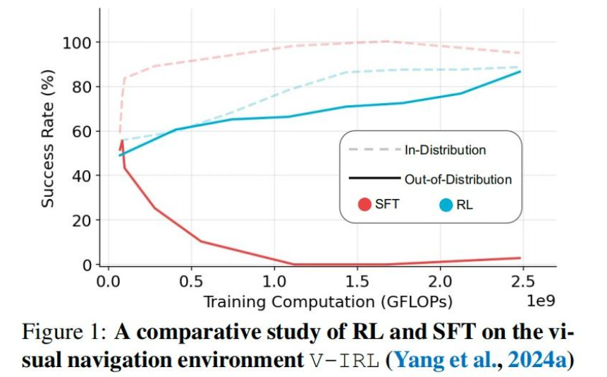

# 3.3 后训练（Post-train）

目标：实现**Human Alignment** (与人类意图对齐)，即让模型更好地理解和响应人类指令。

技术路线：
- **SFT(Supervised Fine-Tuning):** 微调模型，使其更好地适应人类指令。
    - 特点：指令跟随、学习新格式、小学习率(1e-5 ~ 5e-5)
    - 注意：微调模型时需保留预训练数据防止性能退化
- **RLHF(Reinforcement Learning from Human Feedback):** 利用强化学习（RL）机制，让模型根据人类反馈进行自我训练。
    - 特点：利用强化学习机制，结合人类反馈，自我训练模型。
    - 注意：RLHF需要大量的人类反馈数据来训练奖励模型(Reward Model)提供奖励信号。

    > 此外，引入强化学习(RL)机制能够为模型提供负反馈，帮助它更好地识别正确与错误的边界，这对于提升模型性能具有至关重要的作用。

