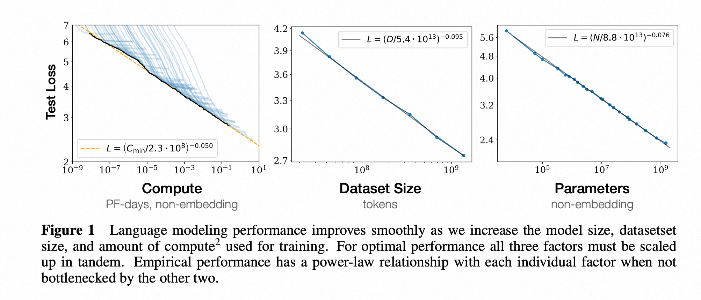

# 3.3.2 RL

**强化学习 RL(Reinforcement Learning)** 一定是非常重要的，SFT后RL一下往往能涨点。Pretrain和SFT都只是在正确的token上进行拟合，模型只知道什么是正确的输出，不知道什么是错误的，缺乏负反馈带来的信号。而RL的feedback在告诉模型什么是正确的同时，也告诉了你错误的雷区在哪里.

> **强化学习真正强大与美妙之处在于：** 我们并非明确地教导模型如何解决问题，而是仅仅为其提供恰当的激励，它便能自主地开发出先进的问题解决策略。

[Scaling Law 2020](./img/2020scaling_law.png)

  

    
     
    <a href="./img/nextlow202401.png">Pretrain is end. 2024</a>
    </img>
  

我们解决一个问题都是从短板入手，短板解决了，才能有比较大的提升。

前OpenAI首席科学家*llya*都说过LLM Pretrain都快到头了，尽管存在一定争议，但是共识肯定是Pretrain遇到了很大瓶颈。

> 那么，训练了足够久，补足了模型规模，数据集规模，**下一个短板是什么？**

