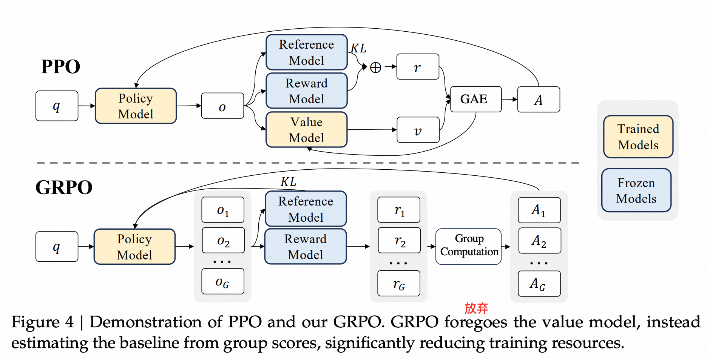

# 3.3.2.2 对RL算法的创新点 GRPO
**GRPO(Group Relative Policy Optimization)** 提出于*DeepSeekMath*，并非最早出现在R1论文。

在RLHF中，由于PPO算法使用的**Value Model(价值函数)** 通常是与**Policy Model(策略模型)** 大小相当的另一个模型，因此它会带来大量的内存和计算负担。在RL训练期间，价值函数被用于计算方差减少的advantage(优势值)的baseline(基线值)。

但是，在LLM上下文中，通常只有最后一个标记才会被**Reward Model(奖励模型)** 分配reward score，这会使训练每个token都给予准确的价值函数变得复杂。

- **GRPO删除了Value model,使用对同一问题产生的多个采样输出(来自旧的Policy model)的平均奖励作为baseline取代Value model的作用**

[GRPO](./img/GRPO.png)

- **Policy Model：** 就是我们要训练的那个模型，也就是做决策的模型
- **Reference Model：** 强化学习中可以理解为神经网络训练中需要的GT，或者蒸馏系统里面的teacher，总之就是一个高性能模型。PPO里面就是原始的微调前的模型，这个模型的作用就是确保新优化的策略模型不会过度偏离初始的生成能力，保持输出的稳定性和连贯性
- **Reward Model：** 给输出打分的，LLM中一般是给最后一个token打分，不一定是一个模型，也可以是规则
- **Value model：** 需要训练，用来估计每个状态（或生成步骤）下的预期总奖励。比如有些步骤很重要，那么socre就很高。在棋类之类的序列决策中是否需要延迟满足，而非每一步都是贪婪。它是用来做这一步未来能获得多少奖励的评判标准。

***
[GRPO目标](./img/GRPO_loss.png)

[GRPO Loss](./img/loss.png)

上式是GRPO的Loss计算公式。

我们宏观理解下，GRPO的公式可以看作两个部分:
- 第一个部分是**红蓝块:**  对应于PPO算法的重要性采样部分和clip裁剪。
- 第二个部分是**绿块:**  是KL散度的一阶泰勒估计式，用来减少两个分布之间的差异。

