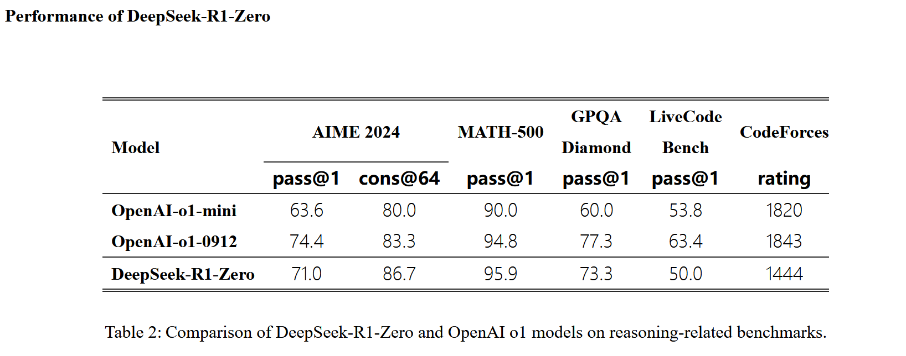

# 3.3.2.1 RLAIF
Deepseek团队用论文[*DeepSeek-R1: Incentivizing Reasoning Capability in LLMs via Reinforcement Learning*](https://arxiv.org/abs/2501.12948)直接回答了这个问题，研发团队认为LLM下一个短板就是**推理(Reasoning)**. 

这篇文章中，主张直接使用纯强化学习(*仅格式奖励+结果奖励* )，减少人工干预和人工标记的成本，反而可以提升LLM的推理能力。
- 使用基础模型DeepSeek-V3-Base，只要经过几千个steps, **DeepSeek-R1-Zero** 就可以达到OpenAI o1的水平！

***

- 最终训练得到的**DeepSeek-R1模型** 在多项测试中都超过了OpenAI-o1的水平，包括推理能力、语言模型、语法能力、阅读理解能力等。

