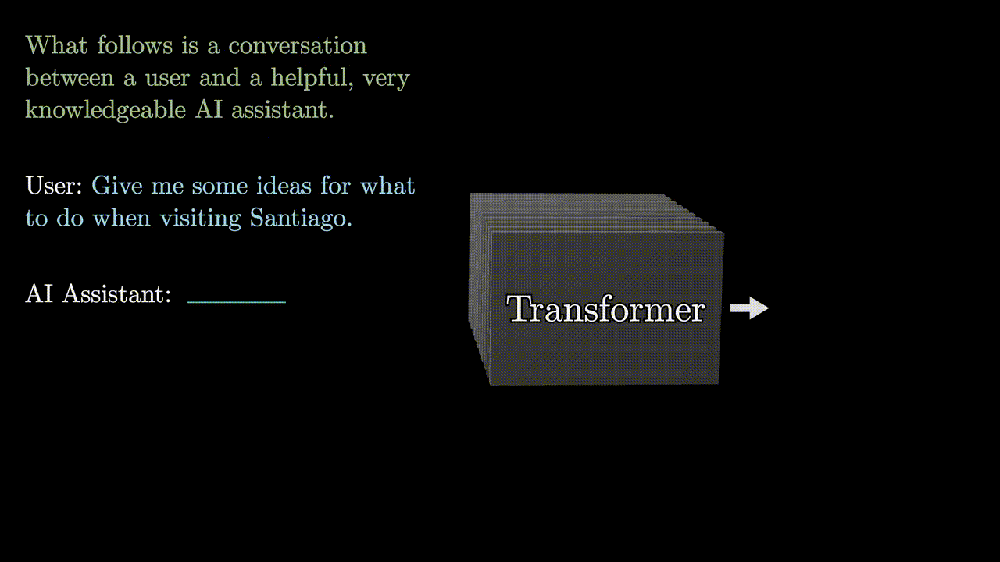
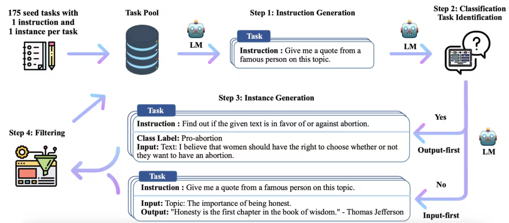

# 3.3.1 SFT

工程上**SFT(Supervised-Finetune)** 更好做。

虽然本质上SFT也是做next token prediction loss,但是和预训练(Pretrain)时对大量文本的直接学习不同,由于SFT阶段文本都是以prompt开始,故而会在计算loss的时候添加一个mask,只在prompt后面的部分计算loss.

***

SFT训练阶段的基本特点:
- **词表里的special token开始发挥作用:** 比如有些用来标识"\<user\>", "\<assistant\>"之类
- **指令微调数据不定长:** 比如4K,后面可能还会长文本富集一下,逐步提升到16K,32K的训练;而pretrain的时候一般都是padding再pack到定长的.
- **主要目的是为了让模型学会新的format:** 无法在此阶段引入新的知识,哪怕是大量finetune,世界知识还是在吃pretrain的老本.
- **follow instruction:** 和pretrain完模型只会续写不同,SFT模型需要学会在\<eos\>停下来.
- **learning rate很小:** 相比pretrain一般1e-4到5e-4的量级,sft可能只有1e-5到5e-5
- **SFT相比pretrain数据量很小:** 不过指令跟随能力习得完全靠这部分,所以需要更细粒度的调优把控,尤其是数据。

