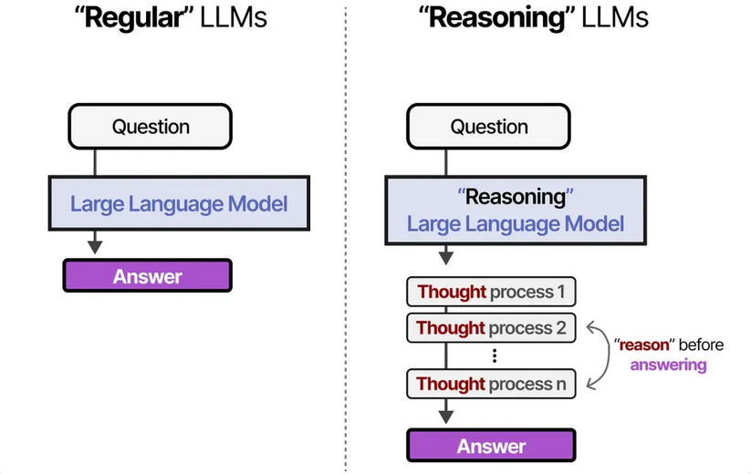

# DeepSeekR1的功能与使用

> LLM不是许愿机  

> 它的回答反映了我们的问题，给它提供更多的内容、情感、结构等，多轮对话可以更好的理解问题。  

## DeepSeekR1核心能力  
- **自然语言理解与生成**  
- **代码辅助编写**  
- **复杂问题推理**（通过思维链 CoT 自动补全信息）  

## 与其他 LLM 的异同  
| **对比项**       | **DeepSeek-R1**                | **其他 LLM（如 Qwen2.5、LLama3）**       |  
|------------------|--------------------------------|----------------------------------|  
| 架构基础         | MoE稀疏化       | Transformer Decode-Only 架构                 |  
| 优化技术         | GRPO、CoT 推理                 | 传统 SFT + RLHF                  |  
| 提示词复杂度     | 低（自动补全信息）             | 高（需结构化提示）               |  

***

