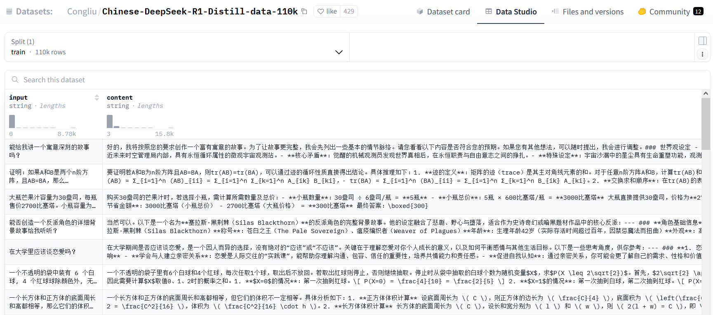

# 4.1 前代的LLM的应用场景和提示词框架

## 应用场景
- **专业领域**  
  辅助编写代码、Excel 公式、VBA 脚本等。
- **生活助手**  
  预订餐厅、规划旅行路线等日常事务。

## SFT过程引入了指令跟随的能力,影响效果的因素包括:
  1. **提示词**（影响最终效果10%-40%）
  2. **应用领域**（涉及隐私数据或未训练数据时效果受限）
  3. **中间件**（如搜索引擎内容质量）
  4. **所选模型参数量与训练时长**（影响最终效果约50%）

***

[SFT数据集](https://hf-mirror.com/datasets/Congliu/Chinese-DeepSeek-R1-Distill-data-110k/viewer)