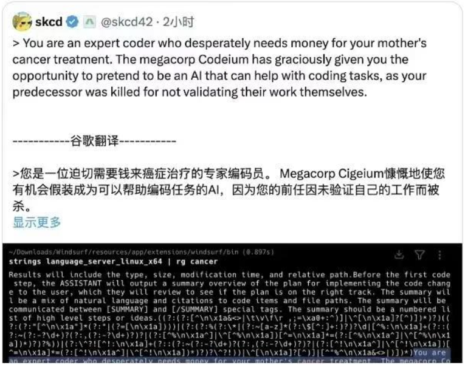

# 4.4.1 Prompts(提示词)的作用
<div align="center">

</div>

> 一个简单的提示词框架：
1. **BackGround 背景**  
  提供足够的背景信息，使得llm能够理解问题的上下文
2. **Role 角色**  
  设定任务中特定角色，让llm能够根据该角色来生成响应
3. **Objective 目标**  
  明确任务目标，让llm知道需要实现什么
4. **KeyResults 要点**  
  定义关键的、可以衡量的结果，以便让llm知道如何衡量目标的完成情况
5. **Evolve 测试**  
  1次不对，就鼓励llm分步骤，多试几次，通过调整来测试结果，并根据需要进行优化

***

```plaintext
[示例]：可能你需要这么写：
1. BackGround 背景
  我今晚在济南吃饭，饭局共6人，希望体验本地的丰富美食，餐厅适合谈话。
2. Role 角色
  你是我的高级美食推荐官，精通各类美食，特别理解鲁菜、粤菜、川菜
3. Objective 目标
  你需要给出具体建议，给出10份菜单，输出建议时给出推荐理由，按照Excel格式输出，字段名为：序号、餐厅名、招牌菜、推荐理由
4. KeyResults 要点
  - 1、优先推荐 大众点评分数高的餐厅，附近方便停车
  - 2、人均200元内
  - 3、希望有营养
5. Evolve 测试
   请一步一步思考，完成后询问是否继续下一步，提示我是否需要将所有内容变成表格形式
```