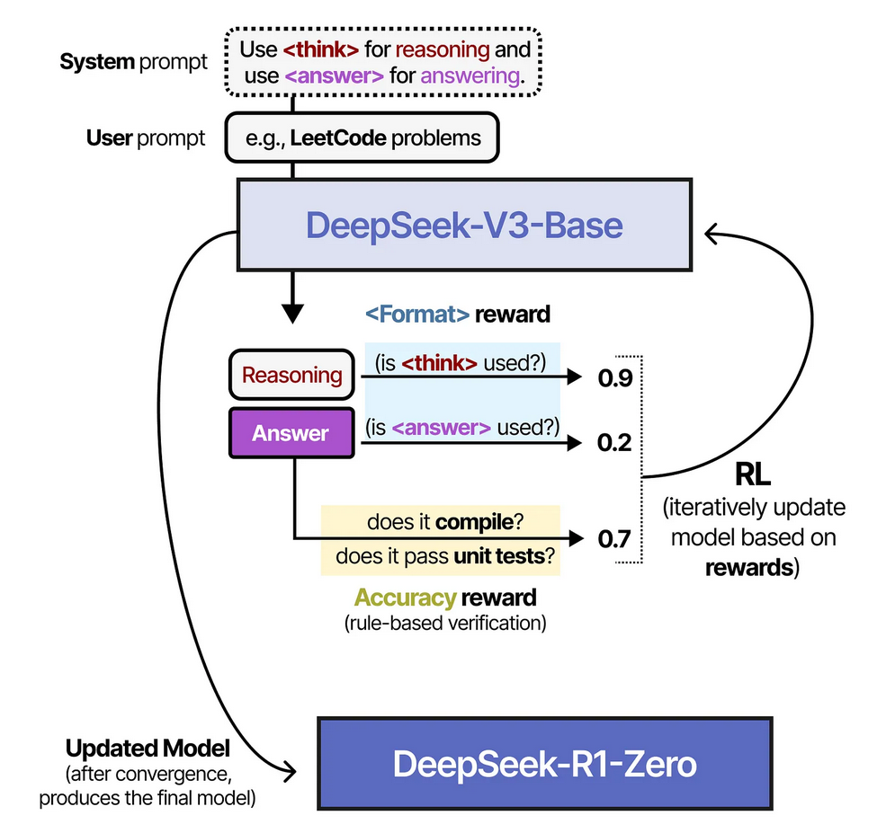

# 5.2 Reasoning RL的探索

大多数传统LLM主要依赖“海量文本的自回归预测”来习得语言模式，再在最后加一层对齐(如RLHF)来提升友好度与准确率；

而推理LLM的方法则将“围绕正确推理的强化学习”置于最核心的位置，从一开始就用一系列奖励机制(**格式化、准确性、可读性等** )来塑造模型的内部表征和行为策略。

## 通过RL诱导模型从已有语料中挖掘推理能力
> **DeepSeek-R1-Zero:** 基于已有语料库和参数充足的Base模型，通过GRPO训练方式逐步诱导推理能力。

- **奖励机制：** 
  - 奖励只对答案正确的**正确奖励** 和
  - 输出形式有\<think\\>…\</think\>\<answer\>…\</answer\>的**格式奖励** 提供奖励
  

- **能力挖掘验证：** 
  - 1.在第0个Epoch的训练中，最初的奖励很大概率只有0，验证了模型在训练初期不太可能产生推理能力；
  - 2.通过略微探索可能的输出方式，从Base模型中把训练集中包含的Reasoning的形式的语料搜索了出来，第一次获得了奖励信号。
  - 3.一旦搜索到了Reasoning的形式的语料，获得了格式奖励的batch之后的训练步里，通过**过程验证**的加入(例如数学形式化验证式，代码执行的结果验证)，模型可以逐步地具有推理的能力。
  

