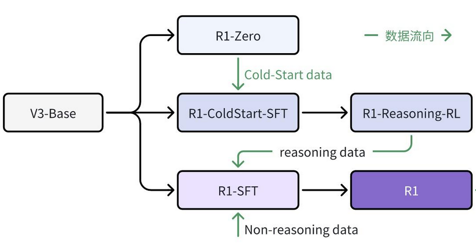
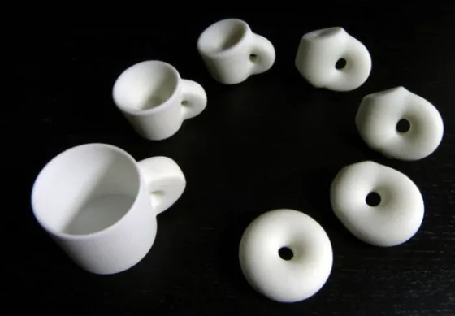

# 5.2.1 <<收获与播种>> 


<div align="center">

</div>

- 关于DeepSeekR1如何将在数学和代码上获得的推理能力**迁移**到文学及其他非定量分析领域，对此有一个的猜想：
  


  ```plaintext
  在探索过程中积累的正确信号可能会帮助模型在抽象层次上识别出逻辑上的“重言式”模式，
  即无论问题的具体内容如何变化，只要遵循一定的逻辑规则，就能得出相似结论。
  
  这类似于数学中不同领域的研究者在各自抽象水平上工作，
  利用领域特定的语言(Domain-Specific Language, DSL)来转换问题，
  直到找到解决方案。
  ```

<div align="center">

</div>


***

## <<收获与播种>> 书中
### A·G回忆在 17岁时候自己的探索“面积、体积观”的内观，和算术几何建立遵循一样的内在的天真。
#### 启发了“自己引导自己构建”与RL的完整对应：
- 正反馈只有结果奖励
  - “直观的侧面、外化与心”（不是什么），指向结果奖励 
  - 验证器，只要有GroundTruth，就会有奖励
  - 确认了箭头
- 和格式奖励： 
  - 形成了箭头 <think> -> <Answer>


> **概型**扇开的有向图 + 某种连通性(**拓普斯**)的对应 <-> “RL训练时候与自己的策略函数里的不太远” 
> 两者是等价的


- **工匠** 对应 利用 exploit
- **探索者** 对应 探索 explore
- **诚实** 对应 真诚的接收feedback
- **孤独** 对应 （他之前描绘的别的数学家在框定内工作，用别人的约束和反馈），自己则是孤独地自己指导、约束和反馈给自己。