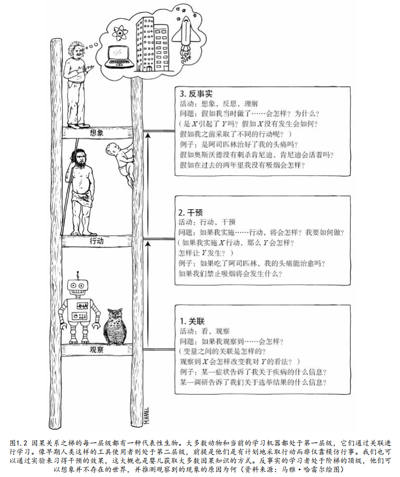

# 5.3.2 信任构建与创新引导

## 角色定义：用户作为验证器
- **核心能力：** 若用户在某些特定领域具备基础的鉴定能力，即可：
  - 1.引导LLM输出更精准的结果；
  - 2.通过过程监督强化奖励信号（如代码执行验证、逻辑一致性检查）。

## 创新信号的提取方法

经验真实就存在部分可观测的情况，也就可能存在混杂。一个观察可以有很多种叙述和猜测的方式，所以正确的机制需要科学的方法进行检验。

- **反证法驱动创新：**
  - 在经验真实的基础上，针对逻辑链的薄弱环节进行验证与修正；
  - 通过迭代反思（如“若前提不成立，结论是否依然有效？”）激发新思路。

  
***

