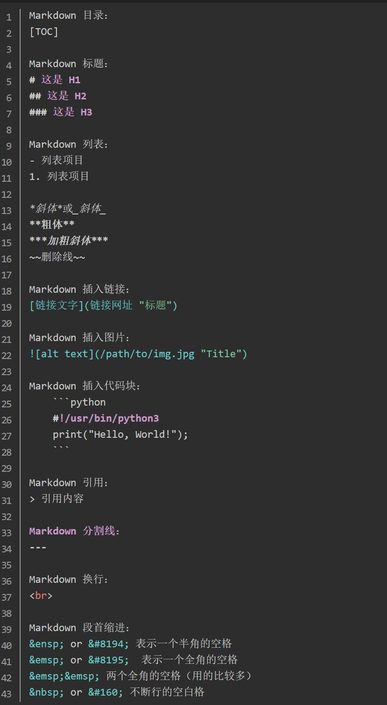
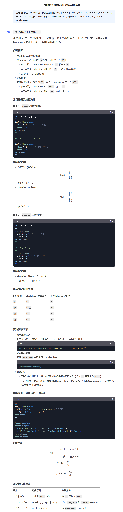

# MDBook的数学笔记的使用小tips
> 2025-03-14

## 1. 文本快速时空关联/回忆追踪

```admonish note
人的短时记忆的上下文是很有限的，观察你的注意力，在阅读的档口只要眼睛碰到了手机，拿起来刷了两下手机，之前要做什么就忘得一干二净了。  
因此在阅读时需要就近地、快速建立关联，以支持人能step further : 通过在md文档中使用锚点，通过链接引入了局部性，一口气读完。

```

链接 : [ELF文件用指针组织的节省内存的数据结构，但并不是人类友好的，人类更喜欢平坦或局部性的材料👇check](https://www.bilibili.com/video/BV1V3XKYLE7d/?share_source=copy_web&vd_source=11141d7b83e628e7a2f8baf703e55130)
![10 - 可执行文件；静态链接和加载 [2025 南京大学操作系统原理]](./img/ELF.png)


### 1.1 md文件页内与页间跳转
[链接 : https://www.cnblogs.com/moyutime/p/14300484.html#fnref1](https://www.cnblogs.com/moyutime/p/14300484.html#fnref1)

```
// 设置锚点
<div id = '锚点id'>锚点文字</div>
or
<a id = '锚点id'>锚点文字</a>
or
<span id = '锚点id'>锚点文字</span>

// 使用锚点
[使用当页锚点内容](#锚点id)
or
[使用外页锚点内容](./xxx.md#锚点id)

```
#### 标题属性
标题可以有自定义的 HTML ID 和类。这让你即使更改标题文本也可以保持相同的 ID，它还让你可以在标题中添加多个类。  
```
# 示例标题 { #first .class1 .class2 }
```
这使得等级 1 标题包含内容“示例标题”，ID 为“first”，以及类“class1”和“class2”。请注意，属性应该用空格分隔。

> id属性的命名规则可以规定为:  
> `定义def`, `定理thm`, `证明lem`, `例子exm`, `注脚note`, `参考ref`, `引理cor`, `推论prop`, `式子form`, `图fig` 

### 1.2 页内注头注脚互跳(写段内概念或引用的文章用)
```
// 使用注脚
[^注脚1]

// 设置注脚
[^注脚1]:注脚内容
```

## 2. 段首空格以及其他的MD符号
```
1. 空格符号：&nbsp;
2. 换行符号：&#10;
3. 回车符号：&#13;
4. 换页符号：&#12;
5. 制表符符号：&#9;
6. 左箭头符号：&#8592;
7. 右箭头符号：&#8594;
8. 左双箭头符号：&#8656;
9. 右双箭头符号：&#8658;
10. 左上箭头符号：&#8677;
11. 右上箭头符号：&#8679;
12. 左下箭头符号：&#8678;
13. 右下箭头符号：&#8681;
14. 左上双箭头符号：&#8648;
15. 右上双箭头符号：&#8650;
16. 左下双箭头符号：&#8652;
17. 右下双箭头符号：&#8654;
18. 加号：&#43;
19. 减号：&#45;
20. 乘号：&#215;
21. 除号：&#247;
```


## 3. mdbook渲染使用[MathJax插件(使用文档)](https://hellowac.github.io/mdbook-doc-zh/zh-cn/format/mathjax.html)渲染公式，公式的语法如下


```
\\[公式\\]   //行间公式,居中

or  //行内公式

\\(公式\\)   

or  //块级公式

$$
\begin{aligned}
P(y|\hat{x},\hat{z_2}) &= \sum_{z_1} P(y|z_1, \hat{x}, \hat{z_2}) * P(z_1|\hat{x},\hat{z_2})  \\\\
                       &= \sum_{z_1} P(y|z_1, x, z_2) * P(z_1|x)   \\\\
\end{aligned}
\tag{3.47}
$$

```

> LaTeX公式语法速查: [https://www.cmor-faculty.rice.edu/~heinken/latex/symbols.pdf](https://www.cmor-faculty.rice.edu/~heinken/latex/symbols.pdf)  

> LaTeX如何打出字母上下标: [https://blog.csdn.net/Albert_Bolt/article/details/86933173](https://blog.csdn.net/Albert_Bolt/article/details/86933173)



## 4. mdbook-admonish美化hints警告框插件[(使用文档)](https://tommilligan.github.io/mdbook-admonish/reference.html#booktoml-configuration)

```
cargo install mdbook-admonish
// 创建项目
mdbook init
// 执行插件自带命令安装, 自动在book.toml中添加配置
mdbook-admonish install
// 构建项目
mdbook build
```
## 5. mdbook-pagetoc插件 [生成右侧目录(使用文档)](https://juejin.cn/post/7330290385590255670)

```
cargo install mdbook-theme
// 插件配置很简单，在 book.toml 中加上如下配置即可
```
```toml
[preprocessor.theme]
pagetoc = true
sidebar-width             = "240px"
content-max-width         = "75%"
content-main-margin-left  = "5%"
content-main-margin-right = "5%"
root-font-size            = "80%"
sidebar-font-size         = "0.85em"

[output.html]
additional-css = ["theme/pagetoc.css"]
additional-js = ["theme/pagetoc.js"]
```


## 6. mdbook-pdf插件 [导出为pdf(使用文档)](https://www.aye10032.com/2023/09/12/2023-09-12-mdbook/)

```
cargo install mdbook-pdf
// 这里安装的时候需要电脑上有chrome或者edge，如果没有，可以安装一个，或者运行以下指令
cargo install mdbook-pdf --features fetch
// 安装完毕后，在book.toml中添加以下内容
```
```toml
[output.pdf]
## Set for auto-retrying if failed to generate PDF.
# trying-times = 1
## This backend only support latest Chromium based browsers, not Safari and Firefox currently.
## If needed, please specify the full path.
## If you specify the wrong binary, chances are that there will be a timeout error.
# browser-binary-path = ""
## Assign the static hosting site url so that relative links outside the book can be fixed.
static_site_url = "https://aye10032.gitbook.io/computernetwork/"
## Check Chrome Devtools Protocol Docs for the explanation of the following params:
## https://chromedevtools.github.io/devtools-protocol/tot/Page/#method-printToPDF
landscape = false
display-header-footer = true
print-background = true
theme = ""
scale = 0.8
paper-width = 8
paper-height = 10
margin-top = 0.5
margin-bottom = 0.5
margin-left = 0.5
margin-right = 0.5
page-ranges = ""
ignore-invalid-page-ranges = false
header-template = "<h3 style='font-size:8px; margin-left: 48%' class='title'></h3>"
footer-template = "<p style='font-size:10px; margin-left: 48%'><span class='pageNumber'></span> / <span class='totalPages'></span></p>"
prefer-css-page-size = true
```

```
// 默认渲染出来的pdf是没有目录的，可以使用
pip install mdbook-pdf-outline
// 安装mdbook-pdf-outline，并在book.toml中添加:
```
```toml
[output.pdf-outline]
like-wkhtmltopdf = true
```
```
// 最后通过mdbook build编译，即可得到PDF文件
```