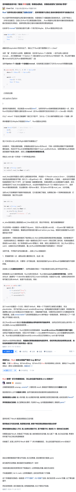

# Rust Notions

## 实时应用程序、性能关键环境中，会遇到必须处理生命周期的场景。
生命周期告诉编译器引用的有效期。只有当，不止一个输入引用并且他们都不是`&self(或&mut self)`时，也需要自己明确写出生命周期(事实证明生命周期大多数时候是隐式的)。

生命周期是会传染的！
一旦添加了生命周期注释，就必须将其添加到所有调用它的函数中，以及所有调用这些函数的函数中，以此类推。
因此，明确的生命周期应被视为最后的手段，因为它在呢个价了技术债务——重构变的更加困难，函数签名会更复杂，更难以理解函数的作用，很难对代码的作用方式作出根本改变，让你陷入困境。生命周期不是免费的，不应在没有充分理由的情境下过早地想一段代码中添加生命周期标注。

实际上发现只有两种情况需要添加生命周期注释：
1. 在性能瓶颈：在热路径中发现了一段运行缓慢的代码，并对其进行了分析，确定瓶颈确实是由于内存分配造成的。在使用更好的算法首先避开热路径不现实的情况下，使用生命周期来避免分配才是有意义的——
```rust
fn foo<'a>(bar: &'a str){...}

Struct Foo {bar:Strin}
==> Struct Foo<'a> {bar: &'a str}
```
2. 所依赖的代码有生命周期标注。

也不要恐惧生命周期标注：记住生命周期是用来帮助编写安全和高效的代码的，它们是Rust工具中一个强大的工具。

避免不必要的复制也可以使用智能指针来避免引入生命周期，如`Rc(引用计数指针)`或`Arc(原子引用计数指针)`，诀窍在于，只需要为字符串分配一次内存，从那时刻起，之后的引用计数就很廉价了，如此，在很多情况下，可以避免生命周期的引入。


***

## 字符串使用

`&str`非常像`&[T]`,是一个指向某些数据胖指针，而`String`则类似于`Vec<T>`

`Vec<T>`到`&[T]`可以自动转换，则，`String`可以到`&str`自动转换。

继承的方法 `Vec<T>`来自`&[T]`，则，`String`来自`&str`。

`&str`更适合作为函数参数(允许调用者传入任何一种字符串)

***

## 原子化类型`Atomic`无锁并发编程的原子化类型。
### 知道： 多线程可以同时读取和写入一个"原子化(操作)"的值而不会导致数据竞争就足够了。

原子化类型会暴露执行原子化操作的方法：单独的加载load、存储store、交换swap和算术运算都会作为一个单元安全的进行，这些方法可以编译成专门的(单条)机器语言指令。参数`Ordering::SeqCst`是指选择顺序一致性的内存排序(最严格的)的性能损失在Rust中通常很低(与数据库中SERIALIZABLE模式时的性能损失截然不同)，因此只要拿不准就尽情使用SeqCst吧！

原子化的一个简单用途是中途取消。假设你有一个线程正在执行一些长时间运行的计算(如渲染视频)我们希望能异步地取消它，问题在于如何与希望关闭的线程通信——可以通过共享的`AtomicBool`来做到。(当然，还有其他方式可以实现：如把`AtomicBool`替换为`Mutex<bool>`或`mpsc`通道，主要区别在于，原子化的开销是最低的——原子化操作从不使用系统调用，加载或存储通常会编译为单个CPU指令！原子化是内不可变性的一种表达形式(就像`Mutex`或`Rwlock`)，因此它们的方法会通过共享引用获取`Self`，这使得它们作为简单的全局变量时非常有用。)

***

## 本章涵盖使用不安全特性的所有要点

- Rust的`unsafe`块建立了边界；
- 可以将函数标记为`unsafe`，提醒调用者这里存在必须遵守的额外契约，以避免未定义行为(UB)；
- 裸指针及其方法允许不受限制地方问内存，进而可能构建Rust类型系统原本会禁止的数据结构，Rust的引用是安全但受限的，而任何C或C++都知道，裸指针是一个强大而锋利的工具；
- 理解未定义行为的定义将帮助你理解为什么它会产生比得到不正确结果还要严重的后果；
- 不安全特性(`unsafe Trait`)与`unsafe`函数类似，但对每个实现而不是每个调用者都强加了必须遵守的约定。
未定义行为在Rust这里的设计是——"Rust坚定地认为你的代码应该永远不会出现的行为。"

`unsafe`块解锁了5个功能：
1. 可以调用`unsafe`函数；
2. 可以解引用裸指针(只有不安全的代码才能真正使用它们访问内存)；
3. 可以访问`union`的各个字段(C语言的结构)；
4. 可以访问`可变的 static`变量；
5. 可以访问通过Rust的FFI接口生命的函数和变量。

`unsafe`块的主要目的在于将人们的视线吸引到Rust无法保证其安全性的代码上(所谓"划出边界")：
1. 你不会无意中使用了不安全特性，然后发现要对连自己都不知道在哪里的责任负责；
2. `unsafe`块会引起审议者的更多关注，有些项目甚至会自动化设施来确保这一点，它们会标记出`unsafe`块代码的更改以引起特别关注；
3. 当你考虑编写`unsafe`块时，可以花点时间问问自己是否真的需要这样的措施(Rust设计为"在编写同样功能的实现上会码更多的代码")，如果为了性能，那是否有测量结果表明这确定是一个瓶颈？也许安全Rust中有更好的办法来完成同样的事。

不要仅仅因为函数体中使用了`unsafe`块或不安全特性就把安全的函数标记为`unsafe`，这会让函数更难用，并使那些期望在某处找到该块的契约说明的调用者感到困惑——正确使用函数的规则是它的契约，契约的存在意味着函数是不安全的，只要是`unsafe`函数就理当有契约的说明。

裸指针本质上等效于C或C++中的指针，因此在与这些语言编写的代码进行交互时很有用。

指向无固定大小类型的裸指针是胖指针：它是包含两个元素的元组，在64位系统中，这两个值通常是`u64`的，因此为 `2 x 8字节 = 16字节`

***

## 错误处理Monad与panic背锅哲学


