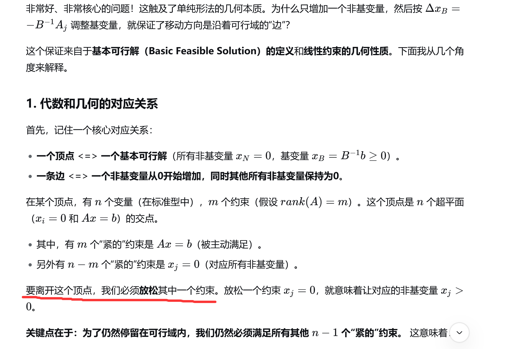

# 线性规划-方述诚-网课2011
> 2025-08-12

方述诚 - 2011

事情的本质是什么，别人是怎么想的。你自己还能怎么想，如何前进。

> deepseek这一版好像有些上述的意思了

## lesson 4-1

primal单纯形法的代数理解中，pivot时选取的边缘方向为何会在基本矩阵M的逆的右半部分？(问询deepseek，在它回答的chain of thought里居然一直没跑偏):

CoT:

1、

2、
