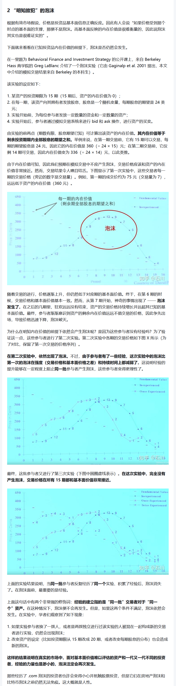

# What happens when you don't see the light?
> 2025-02-15

"只要管用就行，为什么有用不重要"？？？
——这种认知非常危险

对于人工智能发现的任何模式，它有效地前提是我们能够明白无误的理解它的含义：(监督式)深度学习背后的思想本质上是关联，因此属于因果关系的第一阶梯。

因此我们关心的问题是，这个策略到底是在茫茫历史数据中找到了虚假的模式，还是发现了一套真正的科学模式？我们必须从业务层面弄清楚它是如何工作的：何时观察可以学习到因果效应才是关键——如Judea Pearl的结构因果模型所关心的问题。有科学的框架不会错的太离谱。框架是思考问题的规则，是解决问题的规则。不能以此为基础便无法分辨出现好的结果到底是来自运气(过拟合)还是实力。

***

## 《行为投资学小册子》：如何避免成为你最大的敌人
从野外生存的角度(损失)，一个`Ⅱ类错误`假阳性"老虎"远好过一个`Ⅰ类错误`假阴性，你的情感(快系统)错误地战胜了理智(慢系统)。  
而出现在(构建的"野外")投资中的认知偏差就是人们太容易(轻松地)依赖快系统做决定导致的。但如果想在"数字丛林"里生存，往往需要"逆人性"的慢系统来做决策。
### 偏差1 情绪温差 
—— (靠自律是无法解的)只能用规则框住
情绪温差是指当你处于某种情绪状态时，就很难想想自己处于其他情绪状态的情景。  
举个例子，在你不饿的状态下，就很难想象在饥饿状态下的感受和行为；但你饥饿时，感觉就像是你会永远挨饿。  
在投资中，情绪温差也随处可见。

### 偏差2 过度恐惧
——可利用它人的一点  
对损失的过度恐惧会造成在连续观测中做决策不理性，造成在本轮次的错误觉此。  
例如，在超跌到过于便宜时买入，无法做出行为即使已做了系统性分析。

### 偏差3 乐观主义和自利偏差
——真无解，是大脑学习机制和自然延迟效应共同决定的：稀疏条件下，Return的估计方式就是不准，只能乐观不然无法过马路了都  
被"掌控幻觉"放大了乐观，自利偏差让我们愿意相信所有的消息都是有利于当前情况的好消息。

### 偏差3 轻信专家
——可解，所有有限人的局限，基本已破除权威迷信  

在真实的市场中，面对基本面价值难以评估的资产和一代又一代不同的投资者，吃过亏经验的力量也是渺小的，泡沫注定会再次发生。那些经历了.com泡沫的投资者也或许会变得小心并抵触股票投资，但是他们在房地产泡沫和比特币泡沫前仍然无法免疫。  

随着时间的增长，你会慢慢发现，周围的人90%以上都不靠谱，如果你信父母的话，按照他们给的思路安排人生，基本全是坑，如果你听信老师的话，按照学校那套行为准则去面对世界，基本全是坑，如果你听信领导，这个不用我多说了，基本全是大饼，如果你听信伴侣的话，轻易就根据对方的思路调整自己的行为，依然基本全是坑，原因无他，这个世界就是个大草台班子，都是有限人罢了。

***
## "铁汇"闹剧的启示

[链接： 铁汇套利是怎么回事？-许哲](https://zhuanlan.zhihu.com/p/19946368)

1. 群体是会不理性的——当一件事给他家带来巨大的好处的时候，群体会说谎骗自己，让自己舒服(远离不舒服的一如肾上腺素的功用就是存活而来)，大脑是善于让自己舒服的；
2. 组织并非铁板一块，而是各自有利益的群体，管理层可以合伙卖董事会。公地悲剧的博弈结构决定了这样的双输结局必然会重复出现。

没有博弈论做基础，你会以为这些都是愚蠢的人类作茧自缚，其实是你自己没学明白而已。从博弈论的角度看，都是非常合理的——无论是套利者、还是铁汇管理层、董事会，在这件事情中都表现出极不理性，其实一切都是利益使然，"当"一切看上去都那么美好的时候。  

整件事情，参与的任何一方，都知道必然不可持久，仍然发展成如今这个模样，为什么？自作聪明！最有意思的一个哥们，贿赂了高层(他不知道，其实所有人都贿赂了)，觉得自己上头有人，担心完全是naive。  

本来合作可以更好，但这里有2个囚徒困境的结构：
1. 铁汇 与 放大交易量的代理商之间
2. 套利者之间(放慢套利速度，等新入局人增加覆盖出金)
不合作才是囚徒困境的优势策略。不要责怪人性，不要考验人性。博弈结果本来如此。  

- 远离任何形式的黑平台！！！
- 天上不会掉馅饼！！！
- 贿赂也不是可行的，即使在中国！！！
- 交易的实质就是买卖双方的对赌。任何一笔盈利的交易，如果你不明白盈利从哪里来，不要去做，来源异常清晰了，再去做，否则也是个祸根。
- 套利时，只有想明白，自己凭什么赚后，才去做——我异于常人的特殊资源在哪里？为什么我能保持优势？否则，算好退出的时间点。

闹剧里唯一的赢家，真正的聪明人，是在套利刚刚疯狂的时候，大量人涌入时，出金入金顺畅时，放大杠杆做套利，并且在铁汇恢复高增金消息之前全部兑现利润走掉的人，胆子不是一般的肥，在庞氏骗局里火中取栗。

