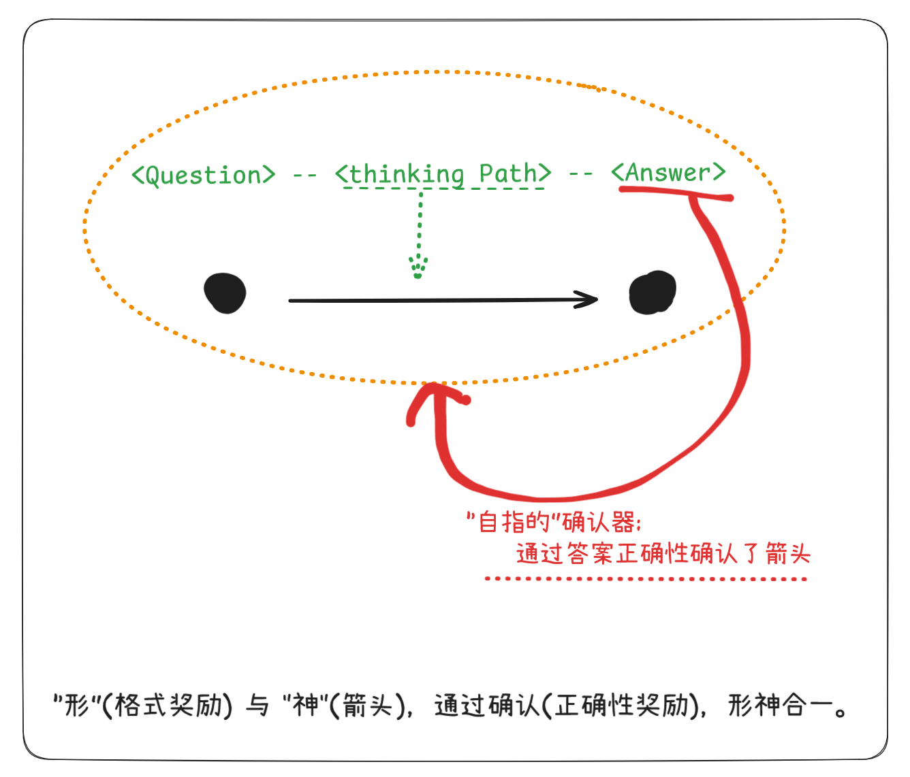
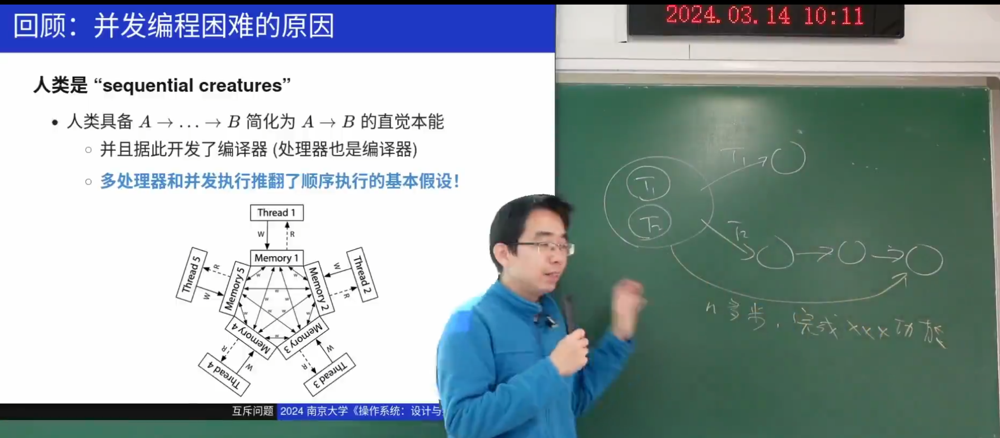

# Sequencial Creature

> 2025-04-02

<a id = 'arrow'></a>
```admonish tip title="优化"


```

**自我存在:** 远离平衡态。(行为定义了定义: "熵减地"去做有效的获取reward的行为，得到能量继续维持非平衡态).  
  
- 所谓的 **理解** ，本质上都是一种粗粒化策略(粗粒化带来熵减)，其实现的过程一定会损失信息的，最终寻找到一个更加可逆的宏观动力学模型。  
  
  - 好的世界模型，一定是具有更强的因果效应，至少要大于对世界(微观动力学)的直接观测的，这样才可以预测模拟乃至于规划未来。用人为的定义粗粒化图2使得其包含的"此时条件"信息得以解释图1，就是"因果涌现"，"因果涌现"是伴随主观简化的。  
  


***

## 0. 序言

### 0.1. 术: 手段

| 年轻人优势的领域 | 同样是收集经验真实, 但是走进科学, 有"贵"的东西 | 
|:--------------:|:-------------:| 
|     探索       | 但是应该科学的探索，探索的目的应是缩窄置信区间  | 
|     利用       | 但是应该科学的利用，自然的直觉是不可否认的，它只能是某种现实的反映，尽管这种现实目前难以掌握，但大体上是可靠的，只不过需要一点深入的分析 |

### 0.2. 道: 目的
  - 生产力: 定义为组织生产
  - 生产关系: 定义为产品和生产要素的流通分配
  - 立论"两手抓, 两手都要硬"
  
## 1. **C** 的生态位
对于新领域，没有任何参考时，刻意抽象(例如OOP)会带来额外负担，并进一步增加系统耦合性，每一次设计调整，往往需要大面积地修改代码。  
  
**C** 从局部迭代，逐步反思全局设计，可以保持低耦合，一个一个模块的来，再逐步尝试组合。强调先有实践，再总结结论，再通过实践检验形成假说，指导下一轮实践，这与人类认识世界的顺序是一样的。  
  
重要的大项目先用 **C** 的方式(面向过程)搭建出原型，把所有问题点都摸透，再用cpp之类"高级语言"重构，达到代码的(胶水式)可维护可扩展的优化--("高级语言"的核心设计是:一切都是为了方便程序员的。如果你能把程序写的更简单、更抗需求变更，那么无论你用了什么模式，你就总是对的；但如果你用了OOP程序变得更复杂、更害怕改动了，那你显然搞错了)。如果是不重要的小项目，直接用 **C** 的面向过程的方式搞(或Python出原型)，简单自由。  
  
**C** 本质是将堆栈和函数调用封装起来的汇编语言，它在这个生态位就是要手动管理堆内存，就这么简单。直接内存寻址与自动堆内存管理互斥。  

## 2. 内存屏障
一条写指令，数据写到L1，指令就算完成了。但CPU还要把L1中的脏数据，写到L2、L3、主存中。这就好像数据库缓存中的脏块一样，并不是在DML语句执行时立刻就要把脏块落盘。对于DML语句来说，只要数据写入缓存，DML语句的执行就结束了。  

## 3. **C** 中的 `volatile` 标记
告诉编译器不要对标记的变量尝试访存优化，阻止编译器对其常量优化。volatile标记的变量的读取和写入，总是从它所在的内存中进行，而不是使用寄存器中的缓存。  
  
相对的`const` 标记，告诉编译器可以将变量的值在编译时计算出来，并将其直接替换到代码中。  

## 4. 过早优化

```admonish check title="如何码？"
### Ⅲ. 对已有代码的优化有两条路
1. [&#10007;] 熟练掌握编译器技术，把手工优化的经验总结出来，固定于编译器上；
2. [&#10003;] 使用profile，找出性能热点，只优化这个热点，并用profile验证是否能真的提升性能，在哪些情况下。

### Ⅰ. 敲代码之前决定、搞定
在动手做 **Ⅲ** 中这些琐碎的优化之前，请先尽量从整体上考虑问题：  
比如，使用 大\\(\Theta\\) 表示法分析算法的整体效率，尽可能分析明白每个消耗较高算法需要的最低复杂度并想办法分析乃至证明你设计的算法的复杂度已尽可能的低了;  
  > 在强人工智能出现之前，这可能是唯一无法内置于编译器的东西！

### Ⅱ. 编译器在多线程/并行优化方面能做的事情还很少
有无并行化架构在理论上确能提效(准备/协议占比、Compute/IO Bound)，统筹高效并行利用硬件。
```

```admonish warning title="过早优化"
如果你没有搞 **Ⅰ**，或搞了 **Ⅰ** 却没做 **Ⅱ** 就动手做 **Ⅲ** 中的优化，那就是"过早优化"。  
```

事实上，得益于发展迅猛的CPU和编译器，绝大多数情况下，解决了 **Ⅰ** 已经解决了一切。甚至，很多时候，很多软件连 **Ⅰ** 都没有解决(或没能力)，用的还是理论最低就要耗费10倍性能的解释器的执行脚本程序，都足够解决现实中99.999%的问题了。  
  
其中， **Ⅰ** 需要较好的数学视野， **Ⅱ** 需要面对问题的整体把控； **Ⅲ** 做到深处，也需要数论、CPU体系结构/执行细节等方面的专业知识，可以确定比 **Ⅰ、Ⅱ** 难得多(但是呢， **Ⅲ** 里面的优化很多技法是可以总结出来 **编译器自动优化** 的，但当你自己写内联汇编--会破坏结构分析等--后编译器最保守的做法是把你编写的汇编当做黑洞不再优化了，实为拣了芝麻丢了西瓜。这就是为何在199x年代，c/cpp编译器还非常不完善、汇编高手还非常多时，编译器也已经能够覆盖90%以上的"高手手工精制汇编"的根本原因)。  
  
不过，那时候CPU还都是单核单线程，不像现在CPU越趋复杂，c/cpp的编译器在多线程/并行优化方面能做的事情还很少--因为它只能看的见最终的语句，看不见问题的全貌--因此，自199x年mmx之类SIMD指令集普遍集成于处理器、以及后来多核多处理器流行之后，各大流行语言也是绞尽脑汁，从并行库到各种编译指示，搞了一大堆方案。但至今仍未达成普遍的一致意见，反而因GPU、TPU、NPU等的掺和，把这个群雄逐鹿的战场搞得更加纷乱了。在这个领域里，超过编译器还是相对容易的。当然，很可惜，哪怕是基本的并行编程，能玩明白的也不多，在你能把多核充分利用之前(Rust教你写啊)，就别和编译器在单线程优化上面较劲了。


## 5. 高级程序语言设计
除了最原始的汇编语言和机器语言，几乎所有的编程语言都有变量。或者可以说，变量的出现是程序设计语言迈向高级的第一步。  
  
早期的程序设计语言对于变量的设计大体三种，而这三种变量的形式影响非常深远，甚至于到目前为止都是区分程序设计语言的主要依据之一：  
  
```admonish check title="这三种变量的设计模式分别为："  
  
1. **变量是表达式的别名**，在这种设计下，变量通常不被允许重新赋值，这一特性也被叫做immutable（不可变性），多见于函数式语言。  
  
2. **变量是值的索引**，在这种设计下，变量通常被允许不受限制的重新赋值，这种设计通常被称之为弱类型或者动态类型，多见于脚本语言。  
  
3. 最后就是最经典的，**变量是内存的槽位**，这是 **C** 语言的设计，在这种情况下，变量只能被赋予同一内存布局的值（通常被称之为类型），这种设计也被叫做强类型或者静态类型。  
```

所以事实上，不可变、强类型检查，等等这些其实都是表象。其核心在于语言如何定义变量是什么。  
  
对于第一种设计，变量是表达式的别名，所以变量和表达式没有本质上的区别，这就带来了延迟求值的可能。即我们写下：`let a = 1 + 2` 的时候，我们并不需要立即计算`1 + 2`这个表达式，我们只需要记住a是`1 + 2`，`1 + 2`就是a即可。我们完全可以在确实需要读取值时再对a进行求值。因为两者等价，所以`a + a`和`(1 + 2) + (1 + 2)`完全等价。我愿意先计算`1 + 2`再进行加法还是展开成`1 + 2 + 1 + 2`再进行计算是没有区别的。  
  
尽管我们写程序的时候，理解代码的行为非常重要。但我们在设计一门程序设计语言的时候，理解设计的初心和依据，则更为重要。  
  
第二种设计多见于脚本语言，在这种设计中，变量通常没有明确的类型。但这其实是一个非常粗浅和浮于表象说法。其本质的原因在于变量被设计为可以不受限制的重新赋值。因为变量本身不存储值，而只是值的索引。  
  
正因为变量被设计为值的索引，所以变量对于可以存储什么值没有任何约束。没有约束导致在一个稍微复杂的上下文中，我们就无法确认变量的类型：导致python重构火葬场  
  
第三种设计就是C语言，也是目前最常见的设计。其实第三种设计非常贴近汇编语言和底层设计，变量就是槽位，正因为变量是存储的槽位，所以变量可以存储的值就有了约束。毕竟你不能用一个字节存储两个字节的数据。  
  
这一个约束就带来了编译器静态检查的可能性。这种设计非常常见就不多费口舌了。 


***

> 2025-04-05

## 6. [planning 计划 (贯序决策评估)](./chapter_4_4.md#plan)
*"行为像智者，其智长存。" —— Rabbbi Hanina ben Dosa(公元1世纪)*


### 6.1. 《看短视频hack有感》 - 链接 : [搞懂流量逻辑，普通人也能拍出爆款短视频](https://www.bilibili.com/video/BV1U6RSYcELN/?share_source=copy_web&vd_source=11141d7b83e628e7a2f8baf703e55130)
每一个视频制作的全流程都是先在脑海里进行plan，后规划实现的过程。  
  
许多时候，最耗费精力的就在此！   
  
缘何？  
  
视频中，up主通过具体的一个视频制作实例，发现了问题。之后分享了核心价值评估点：
- 受众 : who , when , where;
- 普通人看普通事，分享记录普通事;
- 得到平台推流加持(ABTest张 被hack了)  
  
**达到了就是价值点就给reward**。

### 6.2. 回看编程工具使用选择的过程
一如我对Tmux和Vim工具的考察，希望解决在编程实际中的痛点(需求点)，是否可提供？**达到了就给是价值点就给reward**。  
  
先有实践，再有一个改善计划，之后付之于行动。翻译一下：先有实践中具体场景和针对性的目标，而后进行plan，最终规划实现的过程。  
  
### 6.3. 古代原始人类集体计划(并安排)狩猎猛犸象
虽然我们只有一个语义起点(通过对可能世界的测量手段)，但多重世界里的机制也可以是一致、稳定的。  
  
能狩猎到猛犸象的顺序团体行动，**就是价值点就给reward**，就能得到重放，种族得到延续。  
  
很多其他物种在时间长河中，自然选择中遗留下来的功能也是一样的。

### 6.4. 总结: [\<thinking Path\>](#arrow) 对应于 Search , Search 实质是在做 [planning(贯序决策评估)](./chapter_4_4.md#plan)
观察上面这3三个例子，他们的内核都是一致的、共通的。  
  
有需求对应的功能更大可能性在历史经验里关联在一起，增大结果的可能性。  
  
进化遗留的时间历史长河信号(无序地组合式的被保存下来)，**等价于**，一个pre-trained的生成模型。  
  
